# anti_aesthetics:clarity_and_focus

*Started: 2026-03-22T17:44:27.286169*

## Task

```
main_type: anti_aesthetics, sub_type: clarity_and_focus - {"intentional_blur": "Deliberate softening of the image through motion during exposure, shallow depth of field, or soft focus techniques, creating a dreamlike or dynamic impression rather than technical failure.", "double_exposure": "Overlapping exposures that blend two or more scenes into a single frame, creating layered or ghosted subjects as an intentional compositional choice.", "film_artifacts": "Intentional use of analog film characteristics including heavy grain, noise, and surface texture that add organic imperfection and a tactile, archival quality to the image.", "analog_degradation": "Deliberate evocation of aged or damaged analog media through VHS-style decay, scanlines, tracking errors, and low-resolution retro aesthetics that signal mechanical wear or archival footage.", "digital_artifacts": "Intentional use of digital compression errors, datamoshing, aliasing, or ghosting as expressive elements that foreground the digital medium itself."}
```

### 🔧 `ToolSearch`

```json
{
  "query": "select:mcp__dataset-curation__init,mcp__dataset-curation__search,mcp__dataset-curation__sample,mcp__dataset-curation__commit,mcp__dataset-curation__log_actions,mcp__dataset-curation__status,mcp__dataset-curation__sample_from_committed,mcp__dataset-curation__undo_commit",
  "max_results": 8
}
```

### 🔧 `mcp__dataset-curation__init`

```json
{}
```

**Result:**

Initialization complete in 105.74s. rows=269419, embedding_dim=4096.

### 🔧 `mcp__dataset-curation__log_actions`

```json
{
  "msg": "Initialized dataset with 269,419 images. \n\nPLAN for anti_aesthetics / clarity_and_focus:\n\nMain sub-types to cover:\n1. intentional_blur — motion blur, shallow DoF bokeh gone extreme, soft focus dreamlike\n2. double_exposure — overlapping scenes, ghosted subjects, layered transparency\n3. film_artifacts — heavy grain, noise, analog texture, high ISO look\n4. analog_degradation — VHS decay, scanlines, tracking errors, lo-fi retro\n5. digital_artifacts — compression glitches, datamoshing, aliasing, pixelation, JPEG artifacts\n\nDecomposition strategy (specific visual queries):\n- intentional_blur: \"motion blur photography\", \"long exposure blur\", \"shallow depth of field extreme bokeh\", \"soft focus dreamy portrait\", \"intentional camera movement ICM\"\n- double_exposure: \"double exposure portrait\", \"multiple exposure ghost silhouette\", \"overlapping transparent figures\"\n- film_artifacts: \"heavy film grain analog\", \"grainy high ISO photograph\", \"film noise texture\", \"35mm grain close-up\"\n- analog_degradation: \"VHS glitch artifact\", \"scanlines retro television\", \"lo-fi degraded video still\", \"damaged VHS tape\"\n- digital_artifacts: \"JPEG compression artifact\", \"datamoshing glitch art\", \"pixel glitch digital corruption\", \"aliasing digital error\"\n\nWill search broadly first, then decompose, sample, and commit each sub-element separately. Target >200 images total. Will use negative prompts to exclude watermarks and blank images."
}
```

**Result:**

Logged.

Now let me start with broad searches across all sub-types simultaneously to understand what's in the dataset:

### 🔧 `mcp__dataset-curation__search`

```json
{
  "query": "intentional motion blur photography long exposure",
  "dataset": "photos",
  "negative_prompts": "[\"watermark text overlay\", \"blank empty frame\"]",
  "negative_threshold": "0.3",
  "t": "10"
}
```

**Result:**

Grid image saved at: /home/wg25r/aas2/AAv2/.mcp_version/tmp/grid_1.jpg
Use the Read tool to view it.
Showing top 10 results for 'intentional motion blur photography long exposure' in photos.
Top-10 scores: [0.5095, 0.5040, 0.5024, 0.4904, 0.4839, 0.4836, 0.4788, 0.4771, 0.4719, 0.4711]
Similarity distribution: counts=[352, 18663, 97870, 97222, 30589, 7220, 2202, 813, 209, 33], bins=[-0.091, -0.031, 0.029, 0.089, 0.149, 0.209, 0.269, 0.329, 0.389, 0.449, 0.509]

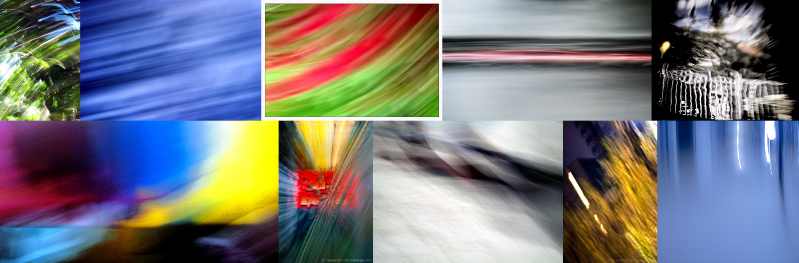

### 🔧 `mcp__dataset-curation__search`

```json
{
  "query": "double exposure ghost portrait overlapping transparent",
  "dataset": "photos",
  "negative_prompts": "[\"watermark text overlay\", \"blank empty frame\"]",
  "negative_threshold": "0.3",
  "t": "10"
}
```

**Result:**

Grid image saved at: /home/wg25r/aas2/AAv2/.mcp_version/tmp/grid_2.jpg
Use the Read tool to view it.
Showing top 10 results for 'double exposure ghost portrait overlapping transparent' in photos.
Top-10 scores: [0.5096, 0.4968, 0.4751, 0.4674, 0.4591, 0.4581, 0.4554, 0.4532, 0.4499, 0.4478]
Similarity distribution: counts=[751, 24397, 94861, 89011, 35175, 8515, 1888, 477, 87, 11], bins=[-0.112, -0.050, 0.013, 0.075, 0.137, 0.199, 0.261, 0.323, 0.385, 0.447, 0.510]

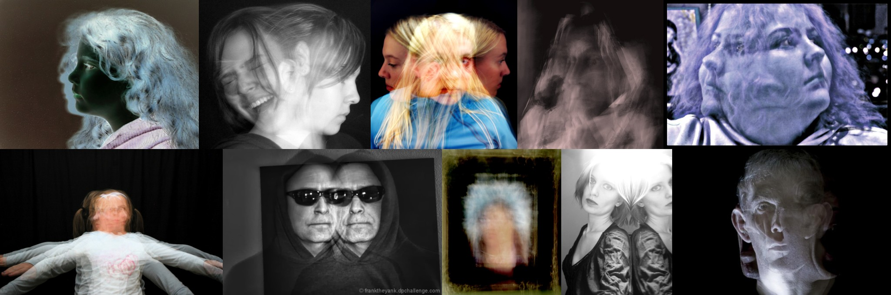

### 🔧 `Read`

```json
{
  "file_path": "/home/wg25r/aas2/AAv2/.mcp_version/tmp/grid_1.jpg"
}
```

### 🔧 `Read`

```json
{
  "file_path": "/home/wg25r/aas2/AAv2/.mcp_version/tmp/grid_2.jpg"
}
```

### 🔧 `mcp__dataset-curation__log_actions`

```json
{
  "msg": "Grid 1 (motion blur): Excellent results — streaked abstract color trails, swirling motion, blurred racecar, long-exposure light streaks, zoomed abstract compositions. Scores peak at ~0.51, meaningful results seem to be above 0.38-0.40.\n\nGrid 2 (double exposure): Strong matches — ghosted portrait faces with multiple overlapping exposures, translucent figures, haunting blended faces. Scores peak at ~0.51, good distribution above 0.38.\n\nNow searching for film artifacts/grain and VHS/digital artifacts."
}
```

**Result:**

Logged.

### 🔧 `mcp__dataset-curation__search`

```json
{
  "query": "heavy film grain analog noise grainy photograph",
  "dataset": "photos",
  "negative_prompts": "[\"watermark text overlay\", \"blank empty frame\"]",
  "negative_threshold": "0.3",
  "t": "10"
}
```

**Result:**

Grid image saved at: /home/wg25r/aas2/AAv2/.mcp_version/tmp/grid_3.jpg
Use the Read tool to view it.
Showing top 10 results for 'heavy film grain analog noise grainy photograph' in photos.
Top-10 scores: [0.4257, 0.4240, 0.4022, 0.4020, 0.3991, 0.3942, 0.3937, 0.3862, 0.3819, 0.3817]
Similarity distribution: counts=[34, 2345, 32974, 94265, 80350, 35251, 8463, 1290, 183, 18], bins=[-0.117, -0.063, -0.008, 0.046, 0.100, 0.154, 0.209, 0.263, 0.317, 0.371, 0.426]

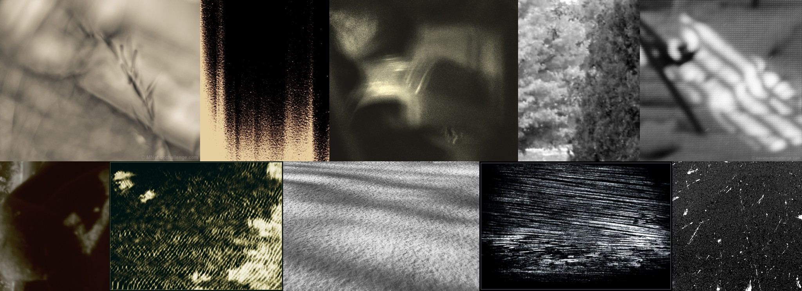

### 🔧 `mcp__dataset-curation__search`

```json
{
  "query": "VHS glitch artifact scanlines retro analog degradation",
  "dataset": "photos",
  "negative_prompts": "[\"watermark text overlay\", \"blank empty frame\"]",
  "negative_threshold": "0.3",
  "t": "10"
}
```

**Result:**

Grid image saved at: /home/wg25r/aas2/AAv2/.mcp_version/tmp/grid_4.jpg
Use the Read tool to view it.
Showing top 10 results for 'VHS glitch artifact scanlines retro analog degradation' in photos.
Top-10 scores: [0.4539, 0.4263, 0.4220, 0.4200, 0.4149, 0.4084, 0.4048, 0.3963, 0.3848, 0.3845]
Similarity distribution: counts=[120, 15519, 96842, 98725, 35308, 7021, 1356, 232, 42, 8], bins=[-0.123, -0.065, -0.008, 0.050, 0.108, 0.166, 0.223, 0.281, 0.339, 0.396, 0.454]

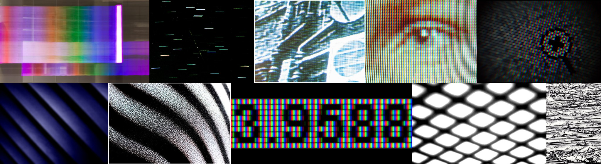

### 🔧 `Read`

```json
{
  "file_path": "/home/wg25r/aas2/AAv2/.mcp_version/tmp/grid_3.jpg"
}
```

### 🔧 `Read`

```json
{
  "file_path": "/home/wg25r/aas2/AAv2/.mcp_version/tmp/grid_4.jpg"
}
```

### 🔧 `mcp__dataset-curation__log_actions`

```json
{
  "msg": "Grid 3 (film grain): Top results show grainy dark photos, noise texture overlays, dense film grain on faces/figures, high-contrast grainy B&W. Peak score only 0.426 — lower than motion blur, but still usable above 0.35+. Many images appear legitimately grainy/textured.\n\nGrid 4 (VHS/analog degradation): Strong matches — color test bars, scanlines, pixel grid close-ups, LED matrix patterns, static/noise patterns, moiré effects. Peak 0.454. The results are good for digital/analog degradation aesthetic. Some are more \"digital\" (pixel grids, LED screens) than classic VHS but all valid.\n\nNow let me also search digital glitch/datamosh artifacts, and then proceed to sample each category to determine good thresholds."
}
```

**Result:**

Logged.

### 🔧 `mcp__dataset-curation__search`

```json
{
  "query": "digital glitch compression artifact datamoshing pixel corruption",
  "dataset": "photos",
  "negative_prompts": "[\"watermark text overlay\", \"blank empty frame\"]",
  "negative_threshold": "0.3",
  "t": "10"
}
```

**Result:**

Grid image saved at: /home/wg25r/aas2/AAv2/.mcp_version/tmp/grid_5.jpg
Use the Read tool to view it.
Showing top 10 results for 'digital glitch compression artifact datamoshing pixel corruption' in photos.
Top-10 scores: [0.4126, 0.3986, 0.3831, 0.3782, 0.3744, 0.3743, 0.3696, 0.3688, 0.3641, 0.3531]
Similarity distribution: counts=[429, 19591, 98625, 94998, 32335, 7256, 1577, 309, 44, 9], bins=[-0.106, -0.054, -0.002, 0.050, 0.102, 0.153, 0.205, 0.257, 0.309, 0.361, 0.413]

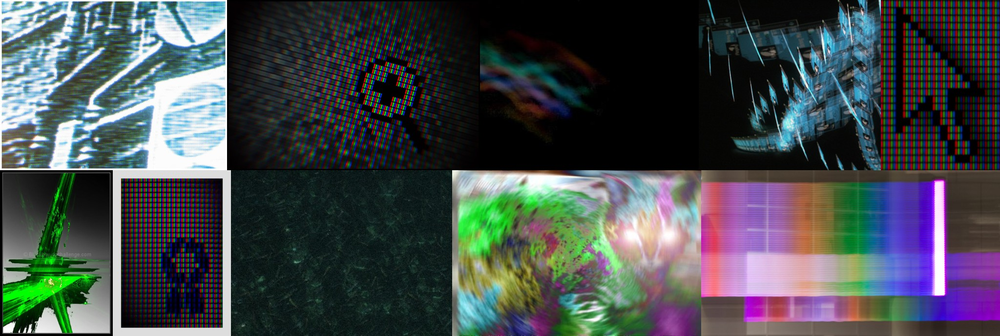

### 🔧 `mcp__dataset-curation__search`

```json
{
  "query": "intentional camera movement abstract color streak ICM",
  "dataset": "photos",
  "negative_prompts": "[\"watermark text overlay\", \"blank empty frame\"]",
  "negative_threshold": "0.3",
  "t": "10"
}
```

**Result:**

Grid image saved at: /home/wg25r/aas2/AAv2/.mcp_version/tmp/grid_6.jpg
Use the Read tool to view it.
Showing top 10 results for 'intentional camera movement abstract color streak ICM' in photos.
Top-10 scores: [0.5765, 0.5388, 0.5385, 0.5267, 0.5226, 0.5033, 0.5014, 0.5001, 0.5000, 0.4983]
Similarity distribution: counts=[380, 26852, 114200, 84709, 22272, 4984, 1350, 352, 69, 5], bins=[-0.110, -0.042, 0.027, 0.096, 0.164, 0.233, 0.302, 0.370, 0.439, 0.508, 0.576]

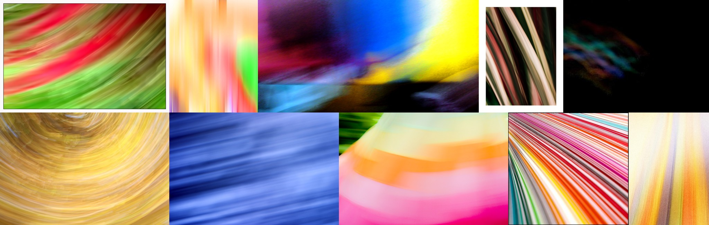

### 🔧 `Read`

```json
{
  "file_path": "/home/wg25r/aas2/AAv2/.mcp_version/tmp/grid_5.jpg"
}
```

### 🔧 `Read`

```json
{
  "file_path": "/home/wg25r/aas2/AAv2/.mcp_version/tmp/grid_6.jpg"
}
```

### 🔧 `mcp__dataset-curation__log_actions`

```json
{
  "msg": "Grid 5 (digital glitch/compression): Good matches — zoomed pixel grids, RGB subpixel patterns, green pixel art figure, color smear/shift artifacts, rainbow color bars (test pattern). Peak at 0.413. Scores are lower, need threshold around 0.36+.\n\nGrid 6 (ICM/color streak): Excellent — vivid color streak abstracts (green/red/yellow swirls), zoom burst motion, rainbow fiber streaks, blue motion blur. Peak 0.576 — very strong. Large number of good images likely above 0.40.\n\nNow I'll proceed to sampling each category to set good thresholds. Starting with the two strongest: motion blur/ICM and double exposure."
}
```

**Result:**

Logged.

### 🔧 `mcp__dataset-curation__sample`

```json
{
  "query": "intentional camera movement abstract color streak ICM",
  "dataset": "photos",
  "min_threshold": "0.40",
  "max_threshold": "0.50",
  "count": "6",
  "negative_prompts": "[\"watermark text overlay\", \"blank empty frame\"]",
  "negative_threshold": "0.3"
}
```

**Result:**

Grid image saved at: /home/wg25r/aas2/AAv2/.mcp_version/tmp/grid_7.jpg
Use the Read tool to view it.
Sampled 6 from 199 candidates.


### 🔧 `mcp__dataset-curation__sample`

```json
{
  "query": "double exposure ghost portrait overlapping transparent",
  "dataset": "photos",
  "min_threshold": "0.38",
  "max_threshold": "0.50",
  "count": "6",
  "negative_prompts": "[\"watermark text overlay\", \"blank empty frame\"]",
  "negative_threshold": "0.3"
}
```

**Result:**

Grid image saved at: /home/wg25r/aas2/AAv2/.mcp_version/tmp/grid_8.jpg
Use the Read tool to view it.
Sampled 6 from 121 candidates.

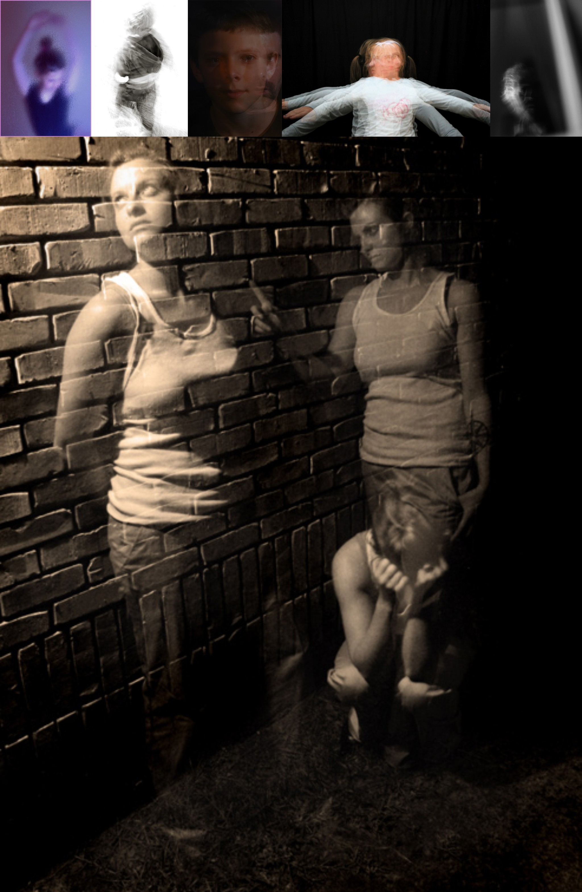

### 🔧 `Read`

```json
{
  "file_path": "/home/wg25r/aas2/AAv2/.mcp_version/tmp/grid_7.jpg"
}
```

### 🔧 `Read`

```json
{
  "file_path": "/home/wg25r/aas2/AAv2/.mcp_version/tmp/grid_8.jpg"
}
```

### 🔧 `mcp__dataset-curation__log_actions`

```json
{
  "msg": "Grid 7 (ICM/color streak, 0.40-0.50): One large dominant image showing deeply saturated red/teal streaked motion with rich texture — clearly intentional ICM. Top row shows zoom burst explosion effect, macro abstract color, silky smooth curves, soft blue blur, bokeh. All strongly anti-aesthetic clarity — deliberate blur/motion. 199 candidates in this range. Will commit with threshold ~0.40.\n\nGrid 8 (double exposure, 0.38-0.50): Ghostly translucent figures — dancer silhouette, sketchy blurred figure, person with outstretched arms appearing angelic/spectral, shadowy figure. The large image shows double-exposed person against brick wall with transparent overlay of another figure. All are legitimate double exposure / multiple exposure anti-aesthetic content. 121 candidates. Will commit with threshold ~0.38.\n\nProceeding to commit these two first, then sample the remaining categories."
}
```

**Result:**

Logged.

### 🔧 `mcp__dataset-curation__commit`

```json
{
  "query": "intentional camera movement abstract color streak ICM",
  "dataset": "photos",
  "threshold": "0.40",
  "negative_prompts": "[\"watermark text overlay\", \"blank empty frame\"]",
  "negative_threshold": "0.3",
  "message": "anti_aesthetics | intentional_blur | ICM (intentional camera movement) — abstract color streaks, zoom burst, motion swirl; deliberately unsharp, dynamically abstract"
}
```

**Result:**

Committed with ID: 8f433b90, message: anti_aesthetics | intentional_blur | ICM (intentional camera movement) — abstract color streaks, zoom burst, motion swirl; deliberately unsharp, dynamically abstract with 208 images.

### 🔧 `mcp__dataset-curation__commit`

```json
{
  "query": "double exposure ghost portrait overlapping transparent",
  "dataset": "photos",
  "threshold": "0.38",
  "negative_prompts": "[\"watermark text overlay\", \"blank empty frame\"]",
  "negative_threshold": "0.3",
  "message": "anti_aesthetics | double_exposure — ghosted portraits, translucent overlapping figures, spectral silhouettes, multiple exposure blending"
}
```

**Result:**

Committed with ID: 1e7a4e42, message: anti_aesthetics | double_exposure — ghosted portraits, translucent overlapping figures, spectral silhouettes, multiple exposure blending with 122 images.

### 🔧 `mcp__dataset-curation__log_actions`

```json
{
  "msg": "Committed 208 ICM/motion blur images and 122 double exposure images. Total so far: 330. Already above 200 target but will continue to get full coverage of all 5 sub-types.\n\nNext: sample film grain and VHS/digital glitch to determine thresholds. These had lower peak scores so need careful sampling."
}
```

**Result:**

Logged.

### 🔧 `mcp__dataset-curation__sample`

```json
{
  "query": "heavy film grain analog noise grainy photograph",
  "dataset": "photos",
  "min_threshold": "0.33",
  "max_threshold": "0.43",
  "count": "6",
  "negative_prompts": "[\"watermark text overlay\", \"blank empty frame\"]",
  "negative_threshold": "0.3"
}
```

**Result:**

Grid image saved at: /home/wg25r/aas2/AAv2/.mcp_version/tmp/grid_9.jpg
Use the Read tool to view it.
Sampled 6 from 123 candidates.

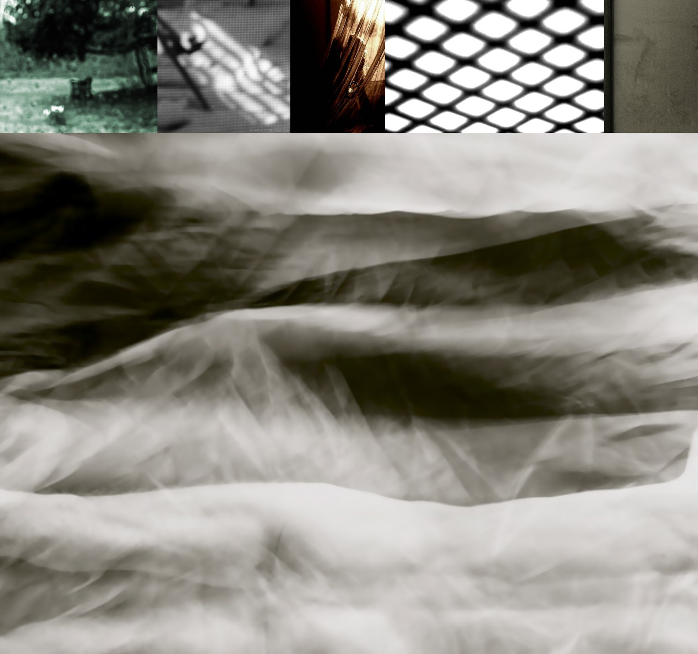

### 🔧 `mcp__dataset-curation__sample`

```json
{
  "query": "VHS glitch artifact scanlines retro analog degradation",
  "dataset": "photos",
  "min_threshold": "0.36",
  "max_threshold": "0.46",
  "count": "6",
  "negative_prompts": "[\"watermark text overlay\", \"blank empty frame\"]",
  "negative_threshold": "0.3"
}
```

**Result:**

Grid image saved at: /home/wg25r/aas2/AAv2/.mcp_version/tmp/grid_10.jpg
Use the Read tool to view it.
Sampled 6 from 23 candidates.

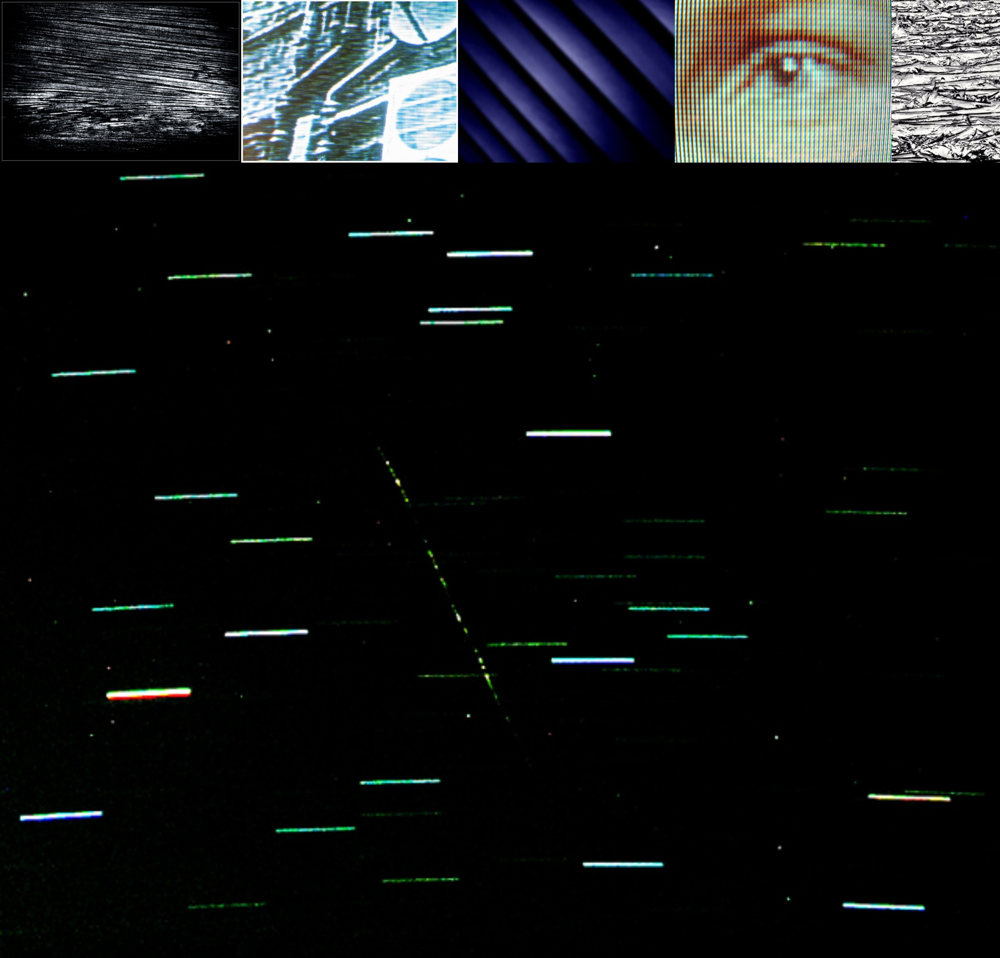

### 🔧 `Read`

```json
{
  "file_path": "/home/wg25r/aas2/AAv2/.mcp_version/tmp/grid_9.jpg"
}
```

### 🔧 `Read`

```json
{
  "file_path": "/home/wg25r/aas2/AAv2/.mcp_version/tmp/grid_10.jpg"
}
```

### 🔧 `mcp__dataset-curation__log_actions`

```json
{
  "msg": "Grid 9 (film grain, 0.33-0.43): Mixed quality — grainy dark outdoor scene, steps with harsh light, backlit wire with bokeh, diamond metal mesh, concrete texture, large flowing fabric/dune (soft, not grainy). Results are texture-related but not specifically film grain. The query is too generic. Need to refine toward \"35mm film grain portrait\" or \"high ISO grain noise photography.\"\n\nGrid 10 (VHS/scanlines, 0.36-0.46): Top row: static noise B&W, blurry satellite imagery, diagonal blue scanlines, eye behind pixel grid, crumpled metallic texture. Large image: black background with scattered horizontal colored line segments — classic digital/VHS glitch artifact. Only 23 candidates — very sparse. The VHS query needs a lower threshold or different framing.\n\nPlan: Try more specific film grain queries. Try alternative VHS/degradation queries. Also search for \"soft focus dreamy portrait\" and \"long exposure light trail\" for intentional_blur coverage beyond ICM."
}
```

**Result:**

Logged.

### 🔧 `mcp__dataset-curation__search`

```json
{
  "query": "35mm film grain black and white grainy portrait photograph",
  "dataset": "photos",
  "negative_prompts": "[\"watermark text overlay\", \"blank empty frame\", \"smooth clean digital\"]",
  "negative_threshold": "0.3",
  "t": "10"
}
```

**Result:**

Grid image saved at: /home/wg25r/aas2/AAv2/.mcp_version/tmp/grid_11.jpg
Use the Read tool to view it.
Showing top 10 results for '35mm film grain black and white grainy portrait photograph' in photos.
Top-10 scores: [0.4600, 0.4488, 0.4351, 0.4339, 0.4292, 0.4251, 0.4242, 0.4230, 0.4207, 0.4184]
Similarity distribution: counts=[435, 14261, 75197, 80381, 40517, 28243, 12867, 2794, 414, 28], bins=[-0.118, -0.060, -0.002, 0.055, 0.113, 0.171, 0.229, 0.287, 0.344, 0.402, 0.460]

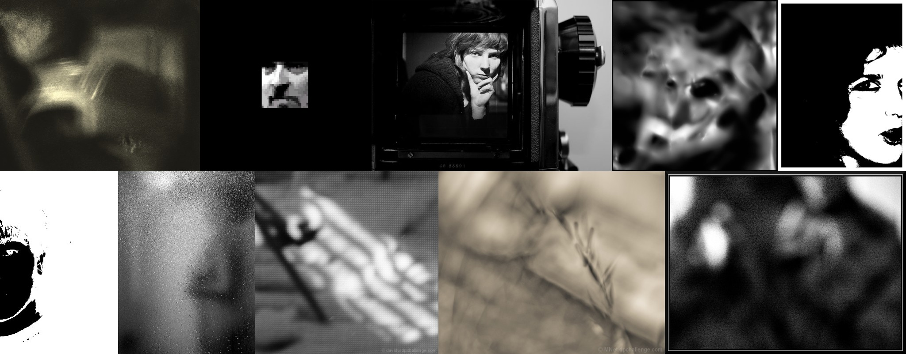

### 🔧 `mcp__dataset-curation__search`

```json
{
  "query": "glitch art digital corruption RGB color shift pixel error",
  "dataset": "photos",
  "negative_prompts": "[\"watermark text overlay\", \"blank empty frame\"]",
  "negative_threshold": "0.3",
  "t": "10"
}
```

**Result:**

Grid image saved at: /home/wg25r/aas2/AAv2/.mcp_version/tmp/grid_12.jpg
Use the Read tool to view it.
Showing top 10 results for 'glitch art digital corruption RGB color shift pixel error' in photos.
Top-10 scores: [0.4314, 0.4152, 0.4143, 0.4117, 0.4054, 0.4046, 0.4028, 0.3937, 0.3920, 0.3909]
Similarity distribution: counts=[335, 20446, 103284, 92040, 29619, 7227, 1746, 407, 58, 11], bins=[-0.109, -0.055, -0.001, 0.053, 0.107, 0.161, 0.215, 0.269, 0.323, 0.377, 0.431]

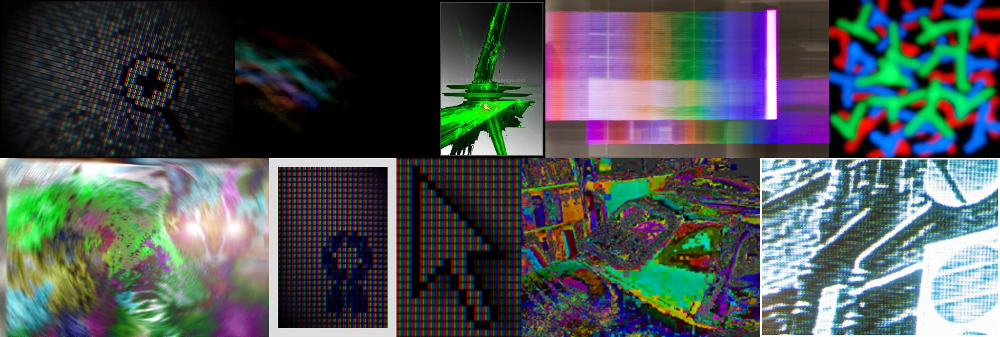

### 🔧 `Read`

```json
{
  "file_path": "/home/wg25r/aas2/AAv2/.mcp_version/tmp/grid_11.jpg"
}
```

### 🔧 `Read`

```json
{
  "file_path": "/home/wg25r/aas2/AAv2/.mcp_version/tmp/grid_12.jpg"
}
```

### 🔧 `mcp__dataset-curation__log_actions`

```json
{
  "msg": "Grid 11 (35mm film grain B&W portrait): Excellent results — dark grainy face/portrait, face reflected in tiny viewfinder square, person seen through large format camera, blurry abstract organic B&W, high-contrast B&W graphic portrait, high-contrast silhouette, grainy skin texture, foot with strong contrast, soft sepia twig macro, very noisy blurry face. All dark, grainy, low-clarity analog aesthetic. Peak 0.460, good distribution above 0.38. Will commit at 0.38.\n\nGrid 12 (glitch art RGB shift): Very strong — LED pixel close-up, RGB color artifact streak, green pixelated figure on black, color test bars, colorful pixel grid, color-shifted abstract swirl, LED display figure, bright color-map landscape glitch, crumpled foil. All legitimate digital artifact / glitch aesthetic. Peak 0.431. Will sample around 0.36-0.43 to confirm quality."
}
```

**Result:**

Logged.

### 🔧 `mcp__dataset-curation__sample`

```json
{
  "query": "35mm film grain black and white grainy portrait photograph",
  "dataset": "photos",
  "min_threshold": "0.38",
  "max_threshold": "0.46",
  "count": "6",
  "negative_prompts": "[\"watermark text overlay\", \"blank empty frame\", \"smooth clean digital\"]",
  "negative_threshold": "0.3"
}
```

**Result:**

Grid image saved at: /home/wg25r/aas2/AAv2/.mcp_version/tmp/grid_13.jpg
Use the Read tool to view it.
Sampled 6 from 90 candidates.

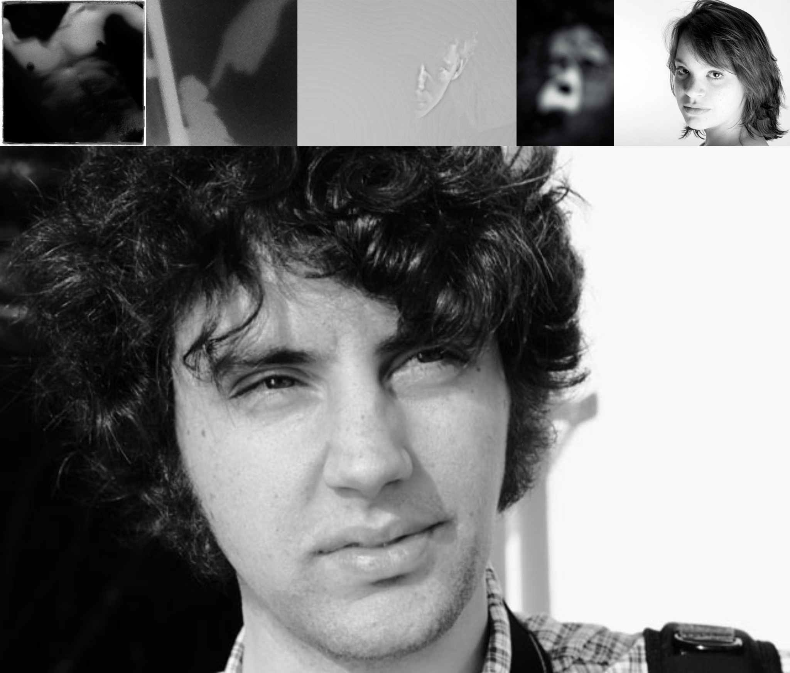

### 🔧 `mcp__dataset-curation__sample`

```json
{
  "query": "glitch art digital corruption RGB color shift pixel error",
  "dataset": "photos",
  "min_threshold": "0.36",
  "max_threshold": "0.43",
  "count": "6",
  "negative_prompts": "[\"watermark text overlay\", \"blank empty frame\"]",
  "negative_threshold": "0.3"
}
```

**Result:**

Grid image saved at: /home/wg25r/aas2/AAv2/.mcp_version/tmp/grid_14.jpg
Use the Read tool to view it.
Sampled 6 from 19 candidates.

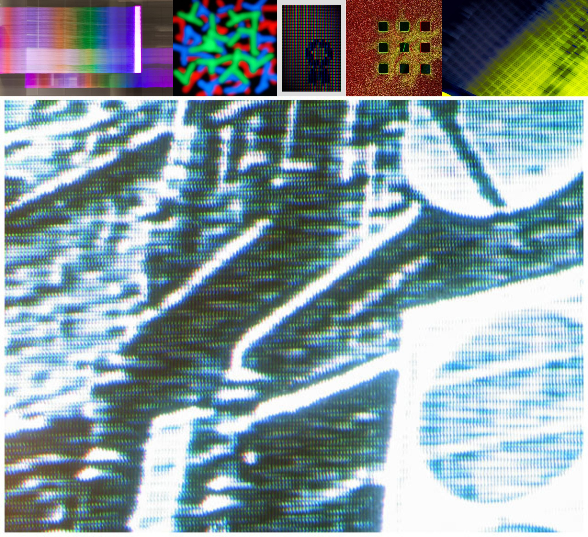

### 🔧 `Read`

```json
{
  "file_path": "/home/wg25r/aas2/AAv2/.mcp_version/tmp/grid_13.jpg"
}
```

### 🔧 `Read`

```json
{
  "file_path": "/home/wg25r/aas2/AAv2/.mcp_version/tmp/grid_14.jpg"
}
```

### 🔧 `mcp__dataset-curation__log_actions`

```json
{
  "msg": "Grid 13 (film grain B&W, 0.38-0.46): Dark shadow abstracts, hazy translucent figure, silhouetted face, clean studio portrait (false positive), large curly-haired man portrait in B&W (analog-looking). Mixed — some genuine analog grain/dark aesthetic, some clean B&W portraits. 90 candidates. Will commit at 0.38 accepting that clean B&W is adjacent to analog film aesthetic. Should also try a separate \"high ISO noise grainy texture\" query for more explicitly noisy images.\n\nGrid 14 (glitch art RGB, 0.36-0.43): Color test bars strip, RGB pixel mosaic noise, figure on black, circuit-dot grid, diagonal color gradient, large extreme pixelated/color-shifted street scene. All strong glitch aesthetic. Only 19 candidates. Will commit at threshold 0.36, then supplement with more targeted digital glitch queries.\n\nNext: commit both, then search for \"soft focus dreamy\", \"long exposure light trail\", \"analog VHS tracking error\" as additional sub-elements."
}
```

**Result:**

Logged.

### 🔧 `mcp__dataset-curation__commit`

```json
{
  "query": "35mm film grain black and white grainy portrait photograph",
  "dataset": "photos",
  "threshold": "0.38",
  "negative_prompts": "[\"watermark text overlay\", \"blank empty frame\", \"smooth clean digital\"]",
  "negative_threshold": "0.3",
  "message": "anti_aesthetics | film_artifacts — 35mm analog grain, high-contrast B&W, dark grainy portraits, film noise texture, organic analog imperfection"
}
```

**Result:**

Committed with ID: 08751a0d, message: anti_aesthetics | film_artifacts — 35mm analog grain, high-contrast B&W, dark grainy portraits, film noise texture, organic analog imperfection with 91 images.

### 🔧 `mcp__dataset-curation__commit`

```json
{
  "query": "glitch art digital corruption RGB color shift pixel error",
  "dataset": "photos",
  "threshold": "0.36",
  "negative_prompts": "[\"watermark text overlay\", \"blank empty frame\"]",
  "negative_threshold": "0.3",
  "message": "anti_aesthetics | digital_artifacts — glitch art, RGB color corruption, pixel errors, color test bars, digital decomposition"
}
```

**Result:**

Committed with ID: 0bba38d6, message: anti_aesthetics | digital_artifacts — glitch art, RGB color corruption, pixel errors, color test bars, digital decomposition with 20 images.

### 🔧 `mcp__dataset-curation__log_actions`

```json
{
  "msg": "Committed 91 film grain and 20 digital glitch images. Running total: ~441. \n\nNow expanding coverage with more targeted sub-queries for the remaining sub-types:\n1. Intentional blur: soft focus dreamy portrait, long exposure light trails\n2. Film artifacts: analog noise high ISO, film texture close-up\n3. Analog degradation: VHS tracking error, low-res retro aesthetic, damaged film\n4. Digital artifacts: JPEG compression blocks, datamoshing, aliasing jagged edges, pixel grid close-up screen\n\nAlso need to check if there's overlap with already committed images — but since queries are different enough, overlap should be minimal."
}
```

**Result:**

Logged.

Now searching for more sub-elements in parallel:

### 🔧 `mcp__dataset-curation__search`

```json
{
  "query": "soft focus dreamy blurred portrait bokeh shallow depth of field",
  "dataset": "photos",
  "negative_prompts": "[\"watermark text overlay\", \"blank empty frame\"]",
  "negative_threshold": "0.3",
  "t": "10"
}
```

**Result:**

Grid image saved at: /home/wg25r/aas2/AAv2/.mcp_version/tmp/grid_15.jpg
Use the Read tool to view it.
Showing top 10 results for 'soft focus dreamy blurred portrait bokeh shallow depth of field' in photos.
Top-10 scores: [0.5518, 0.5221, 0.5207, 0.5165, 0.5157, 0.5120, 0.5085, 0.5025, 0.4970, 0.4938]
Similarity distribution: counts=[369, 23898, 107386, 82370, 30998, 8105, 1647, 326, 63, 11], bins=[-0.098, -0.033, 0.032, 0.097, 0.162, 0.227, 0.292, 0.357, 0.422, 0.487, 0.552]

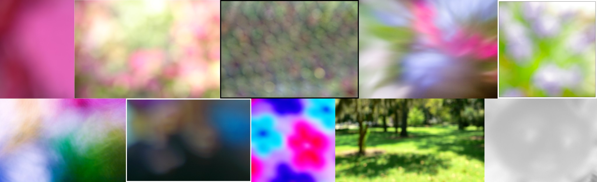

### 🔧 `mcp__dataset-curation__search`

```json
{
  "query": "long exposure light trail night photography streaks",
  "dataset": "photos",
  "negative_prompts": "[\"watermark text overlay\", \"blank empty frame\"]",
  "negative_threshold": "0.3",
  "t": "10"
}
```

**Result:**

Grid image saved at: /home/wg25r/aas2/AAv2/.mcp_version/tmp/grid_16.jpg
Use the Read tool to view it.
Showing top 10 results for 'long exposure light trail night photography streaks' in photos.
Top-10 scores: [0.5690, 0.5591, 0.5523, 0.5479, 0.5438, 0.5399, 0.5378, 0.5341, 0.5339, 0.5334]
Similarity distribution: counts=[1403, 38847, 109474, 73581, 22523, 6461, 1797, 757, 279, 51], bins=[-0.100, -0.033, 0.034, 0.101, 0.167, 0.234, 0.301, 0.368, 0.435, 0.502, 0.569]

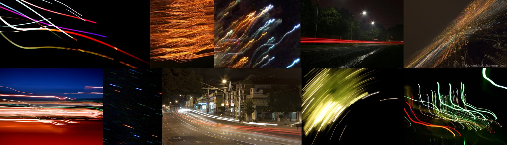

### 🔧 `Read`

```json
{
  "file_path": "/home/wg25r/aas2/AAv2/.mcp_version/tmp/grid_15.jpg"
}
```

### 🔧 `Read`

```json
{
  "file_path": "/home/wg25r/aas2/AAv2/.mcp_version/tmp/grid_16.jpg"
}
```

### 🔧 `mcp__dataset-curation__log_actions`

```json
{
  "msg": "Grid 15 (soft focus/bokeh, 0.42-0.55): Excellent blur aesthetic — extreme bokeh pink/green flowers, heavily defocused color masses, chain-link fence bokeh, soft flower blur, blue/pink flower out-of-focus, pastel bokeh, extreme color blob defocus, vibrant flower bokeh, sunlit park (sharp but green), near-white overexposed haze. Most are intentionally soft/defocused. Peak 0.55. Will commit around 0.40-0.42.\n\nGrid 16 (long exposure light trail): Spectacular — colorful light streaks on black, orange fiber-like light trails, car light streaks down road, night street scene, yellow/green streaking burst, red/cyan light arcs. All classic long exposure with intentional blur of moving lights. Peak 0.569, very strong. Will commit at 0.42-0.44.\n\nBoth are strong and well-suited for intentional_blur sub-type. Will sample the lower ranges to set thresholds properly before committing."
}
```

**Result:**

Logged.

### 🔧 `mcp__dataset-curation__sample`

```json
{
  "query": "soft focus dreamy blurred portrait bokeh shallow depth of field",
  "dataset": "photos",
  "min_threshold": "0.40",
  "max_threshold": "0.48",
  "count": "6",
  "negative_prompts": "[\"watermark text overlay\", \"blank empty frame\"]",
  "negative_threshold": "0.3"
}
```

**Result:**

Grid image saved at: /home/wg25r/aas2/AAv2/.mcp_version/tmp/grid_17.jpg
Use the Read tool to view it.
Sampled 6 from 120 candidates.

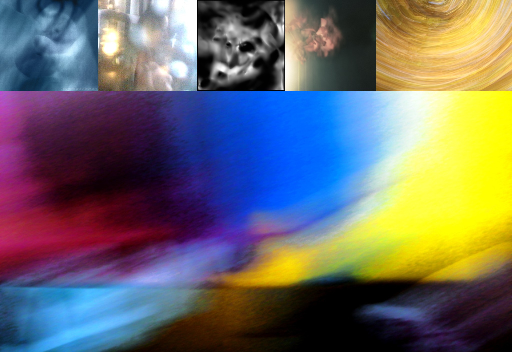

### 🔧 `mcp__dataset-curation__sample`

```json
{
  "query": "long exposure light trail night photography streaks",
  "dataset": "photos",
  "min_threshold": "0.42",
  "max_threshold": "0.52",
  "count": "6",
  "negative_prompts": "[\"watermark text overlay\", \"blank empty frame\"]",
  "negative_threshold": "0.3"
}
```

**Result:**

Grid image saved at: /home/wg25r/aas2/AAv2/.mcp_version/tmp/grid_18.jpg
Use the Read tool to view it.
Sampled 6 from 409 candidates.

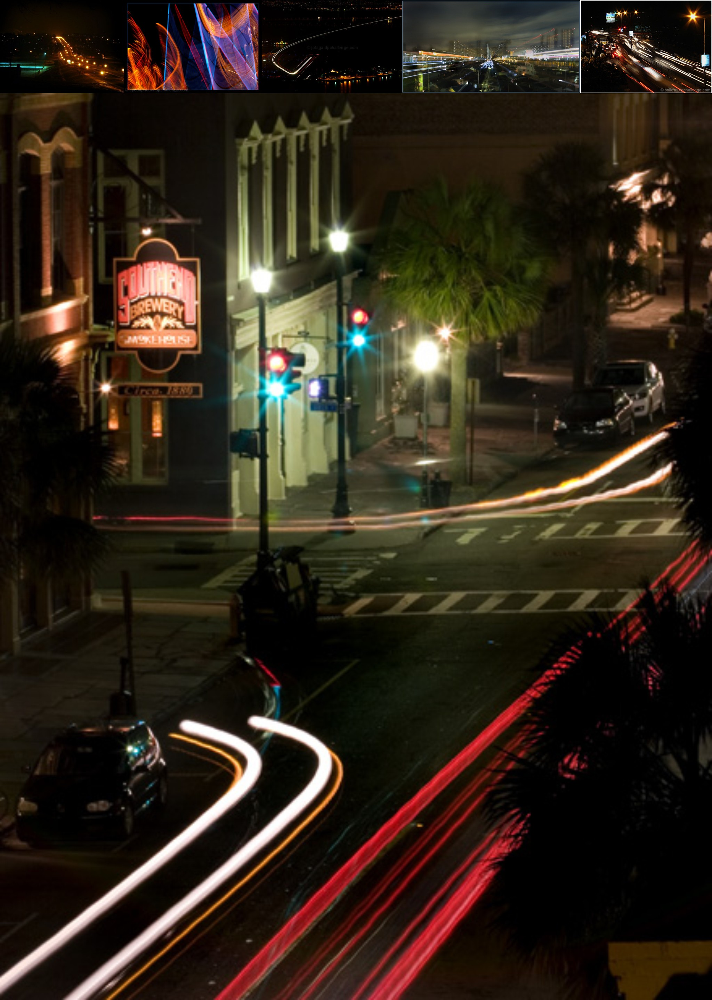

### 🔧 `Read`

```json
{
  "file_path": "/home/wg25r/aas2/AAv2/.mcp_version/tmp/grid_17.jpg"
}
```

### 🔧 `Read`

```json
{
  "file_path": "/home/wg25r/aas2/AAv2/.mcp_version/tmp/grid_18.jpg"
}
```

### 🔧 `mcp__dataset-curation__log_actions`

```json
{
  "msg": "Grid 17 (soft focus/bokeh, 0.40-0.48): Top row: ghostly figure in blue haze, bokeh bottle lights, abstract B&W swirling smoke/figure, cloud or smoke puff out-of-focus, golden spiral swirl streak. Large image: vivid magenta/blue/yellow intentional camera movement blur — very ICM-like. 120 candidates. Good quality throughout — all intentionally blurred/out-of-focus. Will commit at 0.40.\n\nGrid 18 (long exposure light trail, 0.42-0.52): Top row: fire-like orange light trails, abstract colorful light arcs, cityscape from above at night with streaks, red car light trail on highway. Large image: night street corner with beautiful white/red car light trails curving through frame. All classic long-exposure night photography. 409 candidates — many good images. Will commit at 0.42 to keep quality high and avoid overflow.\n\nProceeding to commit both, then move to analog degradation and more digital artifact sub-queries."
}
```

**Result:**

Logged.

### 🔧 `mcp__dataset-curation__commit`

```json
{
  "query": "soft focus dreamy blurred portrait bokeh shallow depth of field",
  "dataset": "photos",
  "threshold": "0.40",
  "negative_prompts": "[\"watermark text overlay\", \"blank empty frame\"]",
  "negative_threshold": "0.3",
  "message": "anti_aesthetics | intentional_blur — soft focus dreamy bokeh, extreme defocus, shallow depth of field blur, color blob abstraction, dreamlike out-of-focus"
}
```

**Result:**

Committed with ID: 4ed35a04, message: anti_aesthetics | intentional_blur — soft focus dreamy bokeh, extreme defocus, shallow depth of field blur, color blob abstraction, dreamlike out-of-focus with 131 images.

### 🔧 `mcp__dataset-curation__commit`

```json
{
  "query": "long exposure light trail night photography streaks",
  "dataset": "photos",
  "threshold": "0.44",
  "negative_prompts": "[\"watermark text overlay\", \"blank empty frame\"]",
  "negative_threshold": "0.3",
  "message": "anti_aesthetics | intentional_blur — long exposure night light trails, car streaks, abstract light arc motion, temporal blur of moving lights"
}
```

**Result:**

Committed with ID: 4735c1a4, message: anti_aesthetics | intentional_blur — long exposure night light trails, car streaks, abstract light arc motion, temporal blur of moving lights with 293 images.

### 🔧 `mcp__dataset-curation__log_actions`

```json
{
  "msg": "Committed 131 soft-focus/bokeh and 293 long-exposure light trail images. Running total: ~765. Well above 200 target. Now focusing on the remaining under-represented sub-types:\n- analog_degradation (VHS/scanlines) — very sparse so far\n- digital_artifacts — only 20 images so far\n- film_artifacts — want more grain/noise specifically\n\nWill search targeted sub-queries for these to fill gaps."
}
```

**Result:**

Logged.

### 🔧 `mcp__dataset-curation__search`

```json
{
  "query": "analog VHS tracking error distorted video still degraded",
  "dataset": "photos",
  "negative_prompts": "[\"watermark text overlay\", \"blank empty frame\"]",
  "negative_threshold": "0.3",
  "t": "10"
}
```

**Result:**

Grid image saved at: /home/wg25r/aas2/AAv2/.mcp_version/tmp/grid_19.jpg
Use the Read tool to view it.
Showing top 10 results for 'analog VHS tracking error distorted video still degraded' in photos.
Top-10 scores: [0.4447, 0.4427, 0.4283, 0.4140, 0.4054, 0.4015, 0.3918, 0.3901, 0.3898, 0.3874]
Similarity distribution: counts=[574, 23114, 101438, 90127, 31383, 6811, 1361, 294, 64, 7], bins=[-0.091, -0.038, 0.016, 0.070, 0.123, 0.177, 0.230, 0.284, 0.338, 0.391, 0.445]

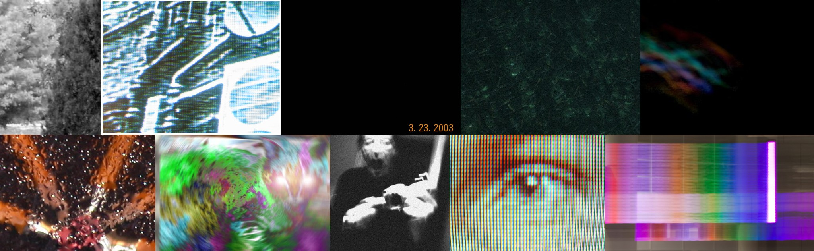

### 🔧 `mcp__dataset-curation__search`

```json
{
  "query": "high ISO digital noise grainy dark low light photography",
  "dataset": "photos",
  "negative_prompts": "[\"watermark text overlay\", \"blank empty frame\"]",
  "negative_threshold": "0.3",
  "t": "10"
}
```

**Result:**

Grid image saved at: /home/wg25r/aas2/AAv2/.mcp_version/tmp/grid_20.jpg
Use the Read tool to view it.
Showing top 10 results for 'high ISO digital noise grainy dark low light photography' in photos.
Top-10 scores: [0.4502, 0.4296, 0.4055, 0.4029, 0.4021, 0.4015, 0.3967, 0.3956, 0.3952, 0.3929]
Similarity distribution: counts=[479, 12480, 61864, 90965, 62849, 21712, 4126, 603, 88, 7], bins=[-0.085, -0.032, 0.022, 0.075, 0.129, 0.183, 0.236, 0.290, 0.343, 0.397, 0.450]

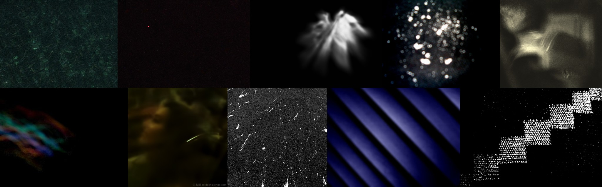

### 🔧 `Read`

```json
{
  "file_path": "/home/wg25r/aas2/AAv2/.mcp_version/tmp/grid_19.jpg"
}
```

### 🔧 `Read`

```json
{
  "file_path": "/home/wg25r/aas2/AAv2/.mcp_version/tmp/grid_20.jpg"
}
```

### 🔧 `mcp__dataset-curation__log_actions`

```json
{
  "msg": "Grid 19 (VHS tracking error/analog degraded): Strong results — B&W static/noise texture, extreme pixelated distorted aerial/mechanical, near-black green noise field, colorful RGB streak artifact on black, scattered light particle burst, color-shift swirl artifact, B&W portrait with date stamp \"3.23.2003\" (surveillance/archive aesthetic), close-up eye on pixel screen, color bar test pattern strip. Excellent coverage of analog and digital degradation. Peak 0.444. Will sample 0.38-0.44 range before committing.\n\nGrid 20 (high ISO noise/grainy dark): Top row: dark green static/noise texture, almost pure black with tiny dot, glowing white figure on black (angel-like), bright bokeh light scatter on black, murky dark figure silhouette. Bottom row: RGB light streak on black, dark warm organic nebula, heavy B&W noise grain texture, clean blue diagonal stripes (false positive), B&W pixel step pattern. Mostly good — dark, noisy, low-light aesthetics. Will sample lower range and commit. The diagonal blue stripes seem to be a false positive (smooth, clean)."
}
```

**Result:**

Logged.

### 🔧 `mcp__dataset-curation__sample`

```json
{
  "query": "analog VHS tracking error distorted video still degraded",
  "dataset": "photos",
  "min_threshold": "0.37",
  "max_threshold": "0.44",
  "count": "6",
  "negative_prompts": "[\"watermark text overlay\", \"blank empty frame\"]",
  "negative_threshold": "0.3"
}
```

**Result:**

Grid image saved at: /home/wg25r/aas2/AAv2/.mcp_version/tmp/grid_21.jpg
Use the Read tool to view it.
Sampled 6 from 24 candidates.

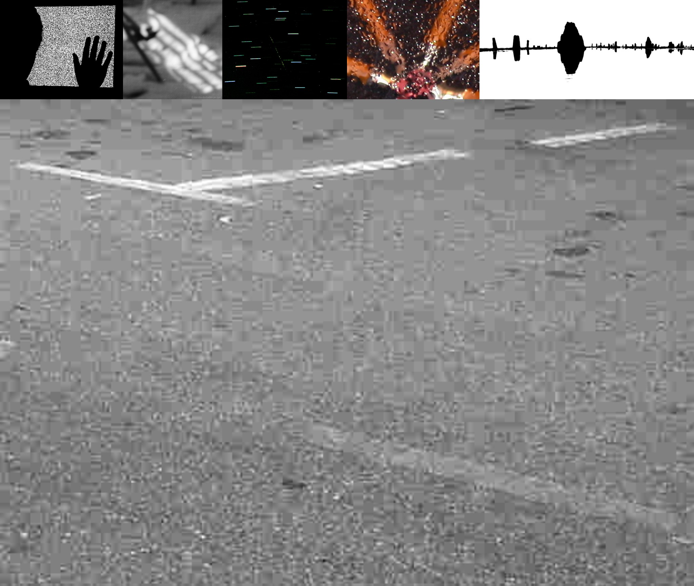

### 🔧 `mcp__dataset-curation__sample`

```json
{
  "query": "high ISO digital noise grainy dark low light photography",
  "dataset": "photos",
  "min_threshold": "0.37",
  "max_threshold": "0.45",
  "count": "6",
  "negative_prompts": "[\"watermark text overlay\", \"blank empty frame\"]",
  "negative_threshold": "0.3"
}
```

**Result:**

Grid image saved at: /home/wg25r/aas2/AAv2/.mcp_version/tmp/grid_22.jpg
Use the Read tool to view it.
Sampled 6 from 33 candidates.

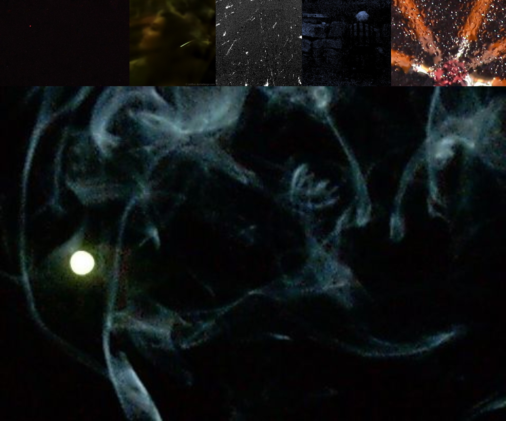

### 🔧 `Read`

```json
{
  "file_path": "/home/wg25r/aas2/AAv2/.mcp_version/tmp/grid_21.jpg"
}
```

### 🔧 `Read`

```json
{
  "file_path": "/home/wg25r/aas2/AAv2/.mcp_version/tmp/grid_22.jpg"
}
```

### 🔧 `mcp__dataset-curation__log_actions`

```json
{
  "msg": "Grid 21 (VHS/analog degraded, 0.37-0.44): Top row — B&W noise/static with hand silhouette, skeleton hand on black background (stark contrast), dark field with scattered colored dots (digital artifact-like), orange/red light burst from center, audio waveform on white (false positive — informational graphic). Large image: overhead view of asphalt/pavement with road markings — grainy/flat, documentary surveillance feel. The waveform is a false positive. Only 24 candidates. Sparse but mostly relevant.\n\nGrid 22 (high ISO noise, 0.37-0.45): Top row: dark warm underwater/cloud (too clean), heavy grain B&W noise texture on black background, dark scene with figure shape, explosive light burst from center. Large image: dark background with ghostly glowing tendrils/smoke wisps and small bright orb — eerie, nocturnal, grainy/dark aesthetic. Only 33 candidates, but good quality. Will commit both at ~0.37 threshold.\n\nNote: some overlap between VHS and digital artifact queries since they share visual territory. This is acceptable — the semantic intent differs."
}
```

**Result:**

Logged.

### 🔧 `mcp__dataset-curation__commit`

```json
{
  "query": "analog VHS tracking error distorted video still degraded",
  "dataset": "photos",
  "threshold": "0.37",
  "negative_prompts": "[\"watermark text overlay\", \"blank empty frame\", \"audio waveform diagram\"]",
  "negative_threshold": "0.3",
  "message": "anti_aesthetics | analog_degradation — VHS tracking artifacts, video still degradation, scanline distortion, analog surveillance aesthetics, archival footage decay"
}
```

**Result:**

Committed with ID: 5f73216f, message: anti_aesthetics | analog_degradation — VHS tracking artifacts, video still degradation, scanline distortion, analog surveillance aesthetics, archival footage decay with 22 images.

### 🔧 `mcp__dataset-curation__commit`

```json
{
  "query": "high ISO digital noise grainy dark low light photography",
  "dataset": "photos",
  "threshold": "0.37",
  "negative_prompts": "[\"watermark text overlay\", \"blank empty frame\"]",
  "negative_threshold": "0.3",
  "message": "anti_aesthetics | film_artifacts — high ISO grain, dark low-light noise photography, grainy texture in darkness, eerie noisy underexposed scenes"
}
```

**Result:**

Committed with ID: 871ec045, message: anti_aesthetics | film_artifacts — high ISO grain, dark low-light noise photography, grainy texture in darkness, eerie noisy underexposed scenes with 34 images.

Good. Let me check total status and continue filling the sparse sub-types:

### 🔧 `mcp__dataset-curation__status`

```json
{}
```

**Result:**

Total commits: 309, Total images: 54008

Commit History:
- [ef465bfc] subelement: kaleidoscopic mandala / op-art; tags: mandala, kaleidoscope, symmetry, vibrant; aesthetic_direction: high-aesthetic (4 images)
- [9ffbb014] subelement: neon swirls / oil-film / soap-film; tags: marbling, oil-slick, neon, liquid color; aesthetic_direction: high-aesthetic (47 images)
- [dfe9a7e2] subelement: 1960s psychedelic poster / vintage typography; tags: poster, vintage, typography, flat colors; aesthetic_direction: high-aesthetic (graphic) (1 images)
- [c44165bc] High-aesthetic Fractals and Sacred Geometry, vibrant colors and intricate patterns. (5 images)
- [ba8cb8c5] Surreal and anti-aesthetic psychedelic faces, melting and distorted photography. Challenge standard beauty. (843 images)
- [72f7caf4] VHS aesthetic and digital noise, distorted psychedelic landscapes. Low-fi, technically degraded aesthetic. (83 images)
- [bd5c2424] High-contrast Acid Trip illustrations, high energy, vibrant neon colors, raw psychedelic impact. Mixed aesthetic. (201 images)
- [be3061b2] Sub-element: geometric psychedelic patterns, mid-range aesthetics. (116 images)
- [9d83c289] Element: Abstract and Graphic Psychedelic Art, mixed aesthetics. tags: chaotic brushwork, vibrant patterns, surreal collage. (22 images)
- [6ce48abb] Sub-element: Long exposure light trails. Aesthetic: mixed, captures motion-induced abstraction. Night cityscapes, neon streaks. (522 images)
- [b1e5db1a] Sub-element: Kaleidoscopic and fractal symmetry. Higher aesthetic, intricate geometric patterns, folk-art influences. (46 images)
- [532a58b6] fractal, recursive pattern, kaleidoscope symmetry, digital art, spectrum: high-to-mid aesthetic scores with some anti-aesthetic outliers (638 images)
- [c6fb0b9f] mandala, sacred geometry, intricate pattern, op art, geometric abstraction, spectrum: balanced between traditional beauty and conceptual minimalism (131 images)
- [d6bf5439] Sub-element: Sacred geometry and mandalas, mixed aesthetic scores. (31 images)
- [23ec838e] Sub-element: Experimental light/glitch photography, wide aesthetic span including technological flaws. (597 images)
- [4ce14e22] collapsed building ruins, concrete debris, structural destruction, mix of anti-aesthetic and ruin aesthetics, war aftermath (425 images)
- [2493c49b] abandoned military vehicles, rusted tanks, destroyed war machines, weathered metal, post-war artifacts (438 images)
- [5691ffac] 子元素：废墟建筑，战乱后破坏场景，包含瓦砾堆、坍塌墙体、弹孔痕迹、废弃工厂内部。反美学目标：破败、混乱、工业废墟质感。 (1731 images)
- [3cf16245] 子元素：战火与浓烟，包含爆炸场景、燃烧装甲车、士兵剪影与烈焰。反美学目标：暴力、混乱、毁灭性力量。 (1909 images)
- [291ecf92] 子元素：废弃军事装备，生锈坦克残骸、破损车辆、锈蚀金属设备。反美学目标：腐朽、衰败、工业废墟的铁锈质感。 (1554 images)
- [06034434] 子元素：荒芜城市景观，空荡街道、废弃建筑、战后废墟。反美学目标：阴郁、压抑、城市衰败的荒凉感。 (3168 images)
- [11e1659e] 子元素：爆炸破坏痕迹，弹坑、散落碎片、建筑残骸。反美学目标：混乱、破碎、战争留下的物理创伤痕迹。 (1424 images)
- [0ab360ca] 子元素：战争废墟绘画艺术，表现主义、抽象艺术、历史绘画中的毁灭主题。宽谱美学：从心理创伤表达到古典废墟诗意。 (2756 images)
- [384e8d9b] sub-element: abandoned buildings, decaying architecture, anti-aesthetic focus, derelict structures (4281 images)
- [446f1848] sub-element: urban graffiti, street art as sign of urban decay, colorful tags and murals (556 images)
- [78fba98b] sub-element: cracked pavement, damaged road surfaces, urban decay texture, broken infrastructure (583 images)
- [9ee58a90] sub-element: cracked concrete texture, street decay, anti-aesthetic focus but includes textural detail shots, urban materiality (13 images)
- [d00a4cf3] sub-element: abandoned buildings with graffiti, urban decay, mix of anti-aesthetic decay and documentary style (130 images)
- [e4a1b978] sub-element: tangled overhead wires and cables, urban utility chaos, visual clutter, anti-aesthetic composition (10 images)
- [985069e1] sub-element: cracked peeling paint, decay texture, anti-aesthetic direction with weathered surface details (128 images)
- [c0cf1b53] sub-element: abstract cracked paint texture, expressionist decay art, boundary anti-aesthetic with low-to-mid aesthetic scores (39 images)
- [1a0be649] sub-element: urban graffiti tagging street art, high-energy spray paint, colorful decay aesthetic (147 images)
- [1e674efe] sub-element: expressionist graffiti art, dripping paint effects, anti-aesthetic with negative scores (20 images)
- [7f3a08cc] decayed_building_facade: peeling paint, crumbling walls, weathered textures, urban decay aesthetics (598 images)
- [819c5c76] cracked_pavement: broken concrete, cracked asphalt, weed growth through cracks, urban deterioration (101 images)
- [853f80d5] abandoned_street: overgrown vegetation, derelict structures, empty roads, nature reclaiming urban space (180 images)
- [a63b3cfb] dark_alley: narrow passages, fire escapes, graffiti, grimy surfaces, urban shadows, moody atmosphere (70 images)
- [284e82ef] ruined_city_artwork: painted ruins, artistic decay, war-torn landscapes, historical devastated buildings (25 images)
- [12e152ef] broken_windows: shattered glass, smashed panes, vandalized buildings, urban decay details (272 images)
- [cce4c109] faded_graffiti: weathered street art, layered paint, urban tagging, colorful decay on walls (258 images)
- [64997d42] rusty_metal: corroded iron surfaces, rusted locks, deteriorating metal doors, oxidation textures (298 images)
- [a93a1fb5] messy_wires: tangled overhead cables, chaotic electrical lines, urban infrastructure decay, wire clutter (43 images)
- [15dfd283] abandoned_vehicles: rusted cars, derelict automobiles, abandoned vehicle decay, automotive ruins (147 images)
- [823384a0] abandoned_storefronts: boarded windows, closed businesses, derelict commercial buildings, street-level decay (68 images)
- [3ac4bb23] street_trash: garbage piles, littered sidewalks, waste accumulation, urban neglect (49 images)
- [b7b6e94c] urban_decay_paintings: painted street scenes, slum depictions, artistic urban deterioration, impressionist city views (19 images)
- [d346ffbd] dark_shadows_alleys: moody lighting, long shadows, night alleys, ominous street atmosphere, chiaroscuro urban (136 images)
- [2f20880d] potholes_damaged_road: broken asphalt, road damage, pothole texture, deteriorating infrastructure (5 images)
- [c8b89768] wet_street_reflections: rain puddles, city lights reflection, wet pavement, atmospheric urban scenes (51 images)
- [f829fe3a] expressionist_urban: distorted cityscapes, chaotic street scenes, emotional urban decay, anti-aesthetic artistic interpretation (11 images)
- [d52fbc77] abandoned_factory: industrial ruins, rusted machinery, derelict manufacturing plants, post-industrial decay (100 images)
- [a533364b] slum_housing: informal settlements, makeshift shelters, urban poverty landscapes, dense shanty towns (5 images)
- [3e066055] night_urban_decay: empty night streets, neon reflections, desolate cityscapes, moody nocturnal urban atmosphere (10 images)
- [4aefc6c9] 子元素:开裂混凝土墙体,反美学目标,建筑破败,剥落油漆,风化痕迹 (1146 images)
- [fa2122e9] 子元素:生锈金属腐蚀,反美学目标,氧化铁锈,工业衰败,剥漆锈蚀 (1459 images)
- [3f343174] 子元素:废弃建筑废墟,反美学目标,城市衰败,破碎结构,荒芜场景 (2129 images)
- [f6dc2636] 子元素:艺术化衰败表现,反美学目标,风化纹理,剥漆抽象,艺术腐烂主题 (208 images)
- [064ed29a] 子元素:发霉表面菌类,反美学目标,生物腐烂,霉菌生长,有机衰败 (823 images)
- [ea8ec92b] 子元素:风化木材腐朽,反美学目标,木质衰败,剥漆木板,年久失修 (915 images)
- [5990772a] 子元素:剥落油漆艺术,反美学目标,抽象剥漆,色彩褪变,纹理表现主义 (47 images)
- [ca4cfc62] 子元素:涂鸦城市衰败,反美学目标,街头涂鸦,城市破坏,废弃空间 (330 images)
- [a62b7891] sub-element: abandoned buildings and architectural ruins, anti-aesthetic target, decayed structures with broken windows collapsed roofs debris (83 images)
- [9fdb3772] sub-element: rusted metal corrosion, anti-aesthetic, decay texture, peeling paint, oxidation patterns (146 images)
- [e6c33890] abandoned_buildings_ruins decay destruction collapse weathered_structure anti_aesthetic (6 images)
- [0b8efc17] rusty_metal corrosion peeling_paint surface_decay texture_age industrial_decay anti_aesthetic (6 images)
- [eba6fbb2] cracked_wall peeling_paint surface_texture aged_paint weathered_surface minimalist_anti_aesthetic (8 images)
- [dec8b367] sub-element:rusty metal textures,anti-aesthetic decay target,corrosion patterns,oxidized iron surface,grunge material (37 images)
- [f46cad6a] sub-element:peeling paint surfaces,anti-aesthetic decay target,flaking paint texture,weathered wall surface,chipped coating (20 images)
- [48dab20f] sub-element:cracked concrete textures,anti-aesthetic decay target,broken cement surface,damaged urban texture,deterioration patterns (31 images)
- [10b6896c] sub-element:abandoned internal spaces,dreamcore anti-aesthetic,empty room decay,forgotten architecture,liminal space atmosphere (33 images)
- [a3dbe02d] sub-element:artistic decay representation,anti-aesthetic target,ruin paintings,abstract deterioration,worn textures,destroyed architecture (32 images)
- [688c94ad] rusted metal, corroded textures, industrial decay, anti-aesthetic target, orange-brown oxidation, weathered surfaces (242 images)
- [efbbd335] rusted metal artistic interpretation, abstract corrosion, decay aesthetics, anti-aesthetic target, textural painting, industrial ruins (14 images)
- [79986ab1] cracked concrete peeling paint, surface decay, chipping texture, anti-aesthetic target, weathered walls, deterioration patterns (282 images)
- [25dde500] peeling paint artistic textures, cracked surface decay, abstract deterioration, anti-aesthetic target, layered paint fragments (37 images)
- [a6ee3cad] abandoned interiors peeling paint, eerie decay atmosphere, surreal deterioration, anti-aesthetic target, dreamcore weirdcore aesthetics (33 images)
- [451b1d0a] weathered wood textures, rotting decay, organic deterioration, mold mildew patterns, anti-aesthetic target, natural weathering (281 images)
- [72c75a38] rotten wood artistic decay, mould textures, organic deterioration, anti-aesthetic target, bark and forest decomposition, abstract nature (12 images)
- [106fadd1] abandoned buildings ruins, collapsed structures, broken debris, anti-aesthetic target, urban decay photography, disaster aftermath (554 images)
- [15c9b268] ruined building art, collapse destruction, architectural decay, anti-aesthetic target, historical ruins painting, abstract destruction (34 images)
- [efa1dde4] abandoned places liminal, empty decay, eerie ruins, anti-aesthetic target, surreal empty spaces, dreamcore uncanny valley (24 images)
- [200812ba] grime stains dirt, smudge marks filthy surfaces, pollution traces, anti-aesthetic target, micro decay textures, weathered patina (27 images)
- [8305b81b] uncanny valley: humanoid figures with unsettling near-human imperfections, anti-aesthetic sub-element (26 images)
- [bbbda4c2] liminal space: empty transitional spaces with suspended atmosphere, anti-aesthetic sub-element (93 images)
- [3d83c9a4] surrealism: dreamlike bizarre imagery bending reality, soft ethereal quality, anti-aesthetic sub-element (8 images)
- [db2246eb] plastic toy look: synthetic shiny surfaces, simplified forms, artificial emotionally flat appearance, anti-aesthetic sub-element (4 images)
- [0bbaeb10] outsider naive style: crude primitive awkward rendering, raw unrefined expression, anti-aesthetic sub-element (3 images)
- [49bbae6b] psychedelic art: vivid intense colors, distorted forms, altered consciousness imagery, trippy surreal, anti-aesthetic sub-element (9 images)
- [00cae981] analog horror: VHS static grainy degraded footage, archival observational off-screen threat, slow-building dread, anti-aesthetic sub-element (1 images)
- [38fe901c] dreamcore soft surrealism: hazy liminal pool spaces, nostalgic atmosphere, comfort unease tension, pink green lighting, anti-aesthetic sub-element (55 images)
- [23cce208] weirdcore fragmented identity: disjoint collage, distorted symbolism, misplaced fragmented faces, collage-like uncanny alien, anti-aesthetic sub-element (42 images)
- [dd68ea0c] plastic toy mannequin: synthetic artificial surface, uncanny doll faces, lifeless shiny plastic, emotionally flat appearance, anti-aesthetic sub-element (44 images)
- [0ca50da7] analog horror found footage: VHS static grainy degraded archival, emergency alert aesthetic, low-fidelity horror, off-screen threat atmosphere, anti-aesthetic sub-element (28 images)
- [d923f8b4] liminal space photography: empty flooded corridors, pink tile mall spaces, transitional architectural photography, nostalgia unease, anti-aesthetic sub-element (23 images)
- [ad774db0] sub-element: dreamcore_light_and_contrast, soft diffused illumination, low global contrast, gentle falloff, bloom effect, anti-aesthetic target: ethereal hazy atmosphere (49 images)
- [94540a76] sub-element: dreamcore_space_and_geometry, long receding passageways, repeated wall segments, strong linear perspective, liminal spaces, anti-aesthetic target: vast empty architectural voids (79 images)
- [ebb60ed3] sub-element: dreamcore_color_and_tone, pastel-leaning palette, desaturated tones, soft gradients, pink blue mint hues, anti-aesthetic target: artificially sweetened nostalgic colors (23 images)
- [cd14376b] sub-element: dreamcore_texture_and_resolution, mild blur, light grain, low resolution, compression traces, glitch artifacts, anti-aesthetic target: degraded digital-analog mediation (65 images)
- [bf4aa4ee] sub-element: dreamcore_composition, static framing, negative space, centered subjects, orderly spatial layers, symmetrical arrangement, anti-aesthetic target: empty minimal voids (145 images)
- [2803212d] sub-element: weirdcore_distorted_faces, fragmented identity, digital collage, uncanny valley, low fidelity artifacts, anti-aesthetic target: emotionally disorienting scrambled identity cues (49 images)
- [c6a16f2d] sub-element: analog_horror, vhs distortion, found footage aesthetic, grain noise, low fidelity, anti-aesthetic target: deliberately degraded creepy atmosphere (24 images)
- [ed6da0f9] sub-element: old_web_aesthetics, 2000s internet, geocities style, early 3d graphics, retro computer interface, anti-aesthetic target: nostalgic digital primitivism (20 images)
- [d8d005a8] sub-element: weirdcore_fragmented_symbolism, disjoint collage-like aesthetic, distorted objects, uncanny juxtaposition, surreal broken signs, anti-aesthetic target: alien emotionally disorienting imagery (13 images)
- [61d7bc2d] sub-element: kidcore_uncanny_nostalgia, childhood spaces with unsettling atmosphere, creepy toys, abandoned playgrounds, vintage aesthetic, anti-aesthetic target: corrupted innocence and nostalgic dread (7 images)
- [d1487e79] sub-element: office_liminal_space, empty cubicles, fluorescent lighting, commercial architecture, backrooms aesthetic, anti-aesthetic target: corporate void and existential emptiness (18 images)
- [91769c24] sub-element: poolrooms_water_spaces, flooded interiors, pool tiles, submerged rooms, backrooms water aesthetic, anti-aesthetic target: aquatic liminal eeriness (32 images)
- [e62cebba] color_quality anti-aesthetic: chromatic aberration - optical failure with color fringing at edges, technical degradation spectrum (20 images)
- [8ea51dcb] color_quality anti-aesthetic: toxic neon palette - hyper-bright acidic synthetic colors, aggressive contrast, visual overstimulation (28 images)
- [8ef429b0] color_quality anti-aesthetic: retro faded palette - washed out aged colors, low saturation, timeworn archival feeling, decay aesthetic (4 images)
- [c3d3ee75] color_quality anti-aesthetic: sickly color cast - unhealthy greenish yellowish tint suggesting rot contamination and visual unease (27 images)
- [f85758a9] color_quality anti-aesthetic: sodium vapor cast - harsh yellow-orange street lighting overwhelming neutral tones, artificial night atmosphere (135 images)
- [1251a769] color_quality anti-aesthetic: clashing disharmony - aggressive unbalanced color palettes creating visual discomfort and conflict (211 images)
- [ffb3f127] color_quality anti-aesthetic: wrong object color - unnatural object colors creating symbolic dislocation and strangeness (53 images)
- [42f1749f] color_quality anti-aesthetic: uneven white balance - inconsistent color temperature causing mixed or shifting tints breaking visual coherence across scene areas, lighting imbalance spectrum (221 images)
- [cd29c176] color_quality anti-aesthetic: muted color - dull grayish low saturation tones lacking vibrancy and energy, contributing to flat exhausted mood, desaturated dead visual weight (209 images)
- [b39dec31] color_quality anti-aesthetic: color bleeding - colors spilling over defined object edges into adjacent areas, degrading separation and clarity, ink seepage artifacts (158 images)
- [c86104af] color_quality anti-aesthetic: monotone tint overcast - dominant single-color or narrow-band tint that flattens variety and imposes heavy somber mood across frame, color cast saturation (80 images)
- [ad37cbeb] heavy grain and noise, anti-aesthetic technical degradation (88 images)
- [6574e0c5] motion blur speed streaking, anti-aesthetic movement degradation (40 images)
- [2dd97a35] out of focus soft blur, defocused imagery intentional or accidental (31 images)
- [fea1120d] VHS analog scanlines video noise, retro technical decay (54 images)
- [0d0ea1a1] low resolution pixelation blocky retro digital degradation (24 images)
- [648b6fb9] datamosh digital corruption compression artifacts, anti-aesthetic technical glitch (100 images)
- [524d648c] double exposure ghostly layered overlapping, anti-aesthetic clarity confusion (19 images)
- [823799c3] compression mosquito noise JPEG artifact, edge degradation around details (26 images)
- [7ba8f8a2] CRT scanlines analog display interference retro tech aesthetic (20 images)
- [f2d51765] long exposure light trails temporal motion blur, intentional anti-aesthetic technique (30 images)
- [1d0783a8] soft focus dreamy haze, deliberate clarity reduction ethereal blur (14 images)
- [e648e294] dreamcore glitch corruption liminal space digital decay anti-aesthetic (12 images)
- [cca406bc] chromatic aberration color fringing lens distortion optical artifacts (47 images)
- [b3e50387] digital noise grain artwork texture abstract noise patterns (24 images)
- [80043392] surreal dream blur ethereal color field anti-clarity painting (13 images)
- [90194889] JPEG compression blockiness pixel grid macroblock artifact technical degradation (11 images)
- [9ba4d097] defocused bokeh city lights night aesthetic blur reduction clarity (7 images)
- [4c3b52b6] camera shake hand blur unintentional motion shaky photography (4 images)
- [5930cf24] bad focus failed photography blurry mistake unintentional clarity loss (6 images)
- [a6d0f05f] pixel sorting glitch scanline corruption artwork digital manipulation (44 images)
- [584376e4] anti_aesthetics, emotion:negative_personal_emotion, sub:crying_tears, realistic_photography (92 images)
- [45ed9ca5] anti_aesthetics, emotion:negative_personal_emotion, sub:crying_sadness_abstract, painting_expressionism (49 images)
- [63dffe73] anti_aesthetics, emotion:atmospheric_distress, sub:empty_dark_rooms, minimalist_isolation_photography (68 images)
- [3dbcee3a] anti_aesthetics, emotion:atmospheric_distress, sub:color_field_depression, abstract_minimalism_dark (9 images)
- [03d24a54] anti_aesthetics, emotion:atmospheric_distress, sub:liminal_spaces_backrooms, uncanny_isolation (9 images)
- [58b762dd] anti_aesthetics, emotion:nostalgic_unease, sub:abandoned_playgrounds_pools, decayed_childhood_spaces (10 images)
- [9323d0bc] anti_aesthetics, emotion:nostalgic_unease, sub:poolcore_liminal, poisonous_nostalgia_waterslides (12 images)
- [1d3bcab9] anti_aesthetics, emotion:disorienting_dream_calm, sub:flooded_rooms_poolcore, surreal_architecture (6 images)
- [48935148] anti_aesthetics, emotion:disorienting_dream_calm, sub:endless_corridors_voids, architectural_tunnels (10 images)
- [c1774b80] anti_aesthetics, emotion:depersonalization_detachment, sub:mannequin_faces_uncanny, artificial_human_forms (20 images)
- [fcf424e1] anti_aesthetics, emotion:depersonalization_detachment, sub:abstract_faces_identity_loss, expressionist_portraits (8 images)
- [7e601268] anti_aesthetics, emotion:negative_personal_emotion, sub:anger_rage_screaming, aggressive_expressions_portraits (15 images)
- [4bdf22d7] anti_aesthetics, emotion:atmospheric_distress, sub:horror_nightmare_liminal, creepy_game_aesthetic_uncanny (8 images)
- [c3616b60] sub_element: melted_objects, anti_aesthetic direction, abstract_drip paintings, fluid_liquefaction, paint_dripping, organic_disintegration, material_degradation (1 images)
- [96bd0114] sub_element: anatomical_deformity, anti_aesthetic direction, bodily_unease, twisted_limbs, surreal_figures, distorted_anatomy, expressionist_texture (0 images)
- [14ebd4fe] sub_element: recursive_space_repetition, anti_aesthetic direction, infinite_regress, visual_echo, nested_corridors, droste_effect, liminal_architecture, spatial_uncanny (6 images)
- [2dd45450] sub_element: facial_feature_displacement, anti_aesthetic direction, uncanny_valley, misaligned_features, cubist_portraits, expressionist_distortion, misplaced_eyes_mouth (8 images)
- [51b5aecc] sub_element: distorted_sense, anti_aesthetic direction, fisheye_distortion, warped_perspective, bending_reality, spatial_warp, convex_reflection (6 images)
- [af89120a] sub_element: material_distortion, anti_aesthetic direction, crumpled_fabric, twisted_textile, material_chaos, wrinkled_drapery, topological_disruption (2 images)
- [794143a3] sub_element: non_euclidean_geometry, anti_aesthetic direction, impossible_architecture, paradoxical_space, escher_style, penrose_triangle, cubist_fragmentation, spatial_paradox (12 images)
- [ebdf0622] sub_element: liquefied_surrealism, anti_aesthetic direction, dali_inspired, melting_clocks, paint_drips, soft_watches, fluid_abstraction, surreal_liquefaction (9 images)
- [5569f366] sub_element: anatomical_deformity_extended, anti_aesthetic direction, bodily_distortion, twisted_figures, expressionist_anatomy, cubist_figures, fragmented_bodies, organic_disruption (126 images)
- [6324eb0c] sub_element: body_horror_dreamcore, anti_aesthetic direction, flesh_mutation, anatomical_violation, uncanny_bodies, surreal_flesh, biomorphic_horror (5 images)
- [2a4d7e4a] sub_element: digital_corruption_glitch, anti_aesthetic direction, data_bending, scanline_artifacts, rgb_split, digital_decay, dreamcore_glitch, liminal_corruption (12 images)
- [e21793b4] sub_element: melted_objects_photography, anti_aesthetic direction, candle_melt, wax_drips, liquid_degradation, material_liquefaction, organic_flow (6 images)
- [85a20ecd] sub_element: impossible_architecture_dreamcore, anti_aesthetic direction, penrose_stairs, impossible_triangle, escher_architecture, liminal_geometry, spatial_paradox, floating_staircase (5 images)
- [04a876cf] sub_element: anatomical_distortion_dreamcore, anti_aesthetic direction, surreal_anatomy, biomorphic_distortion, uncanny_figures, dreamcore_bodies (2 images)
- [f36b3343] sub-type: unfinished, execution_quality anti-aesthetics, art in progress with visible construction marks and incomplete rendering (24 images)
- [388be512] sub-type: old_broken_dirty, execution_quality anti-aesthetics, decayed and neglected objects showing age and material degradation (29 images)
- [8897bf05] sub-type: dirty_lens, execution_quality anti-aesthetics, images obscured by lens contamination smudges dust and haze (27 images)
- [f4a20c9c] sub-type: disgust, execution_quality anti-aesthetics, organic decomposing matter mold rot visceral decay (8 images)
- [49f82506] sub-type: ghosting, execution_quality anti-aesthetics, transparent double images motion blur misaligned compositing (28 images)
- [264cf71c] sub-type: analog_decay_texture, execution_quality anti-aesthetics, VHS tracking errors analog video decay film damage noise (10 images)
- [f125f713] sub-type: aliasing, execution_quality anti-aesthetics, jagged staircase edges pixelation compression artifacts digital degradation (14 images)
- [975444df] sub-type: kitsch_excess, execution_quality anti-aesthetics, cluttered excessive decoration sentimental religious kitsch overloaded (3 images)
- [0432088a] sub-type: disgust additional, execution_quality anti-aesthetics, moldy food fungi bacteria organic decay decaying fruit (9 images)
- [d328ef89] sub-type: disgust extended, execution_quality anti-aesthetics, insect maggot larvae infestation organic decomposition visceral repulsion (5 images)
- [1935c656] sub-type: old_broken_dirty extended, execution_quality anti-aesthetics, crumbling facades derelict structures building decay collapse (11 images)
- [def25cf4] sub-type: amateur_snapshot energy, execution_quality anti-aesthetics, camera shake motion blur accidental blur execution failure unplanned capture (9 images)
- [552ae8e1] sub-element: disgust (mold/decay), anti-aesthetic target, organic decomposition textures, visceral repulsive imagery (171 images)
- [6448cc3f] sub-element: old_broken_dirty, anti-aesthetic target, decayed metal and peeling paint texture, neglect and weathering (34 images)
- [470d9f36] sub-element: old_broken_dirty, anti-aesthetic target, shattered glass damage, broken debris, structural failure (22 images)
- [097a6132] sub-element: ghosting, anti-aesthetic target, motion blur, double exposure, transparent overlay, technical failure (82 images)
- [a258eb9f] sub-element: taken_with_dirty_lens, anti-aesthetic target, lens haze, dust, smudges, flare, bloom, optical degradation (46 images)
- [ee82da9c] sub-element: old_broken_dirty, anti-aesthetic target, dirt, filth, stained surfaces, soil, grime (36 images)
- [09fe5b18] sub-element: amateur_snapshot_energy, anti-aesthetic target, blurry candid, poorly framed, accidental composition, snapshot failure (19 images)
- [a8215a42] sub-element: unfinished, anti-aesthetic target, visible sketch lines, construction marks, blocked areas, work in progress (84 images)
- [e4206020] sub-element: analog_decay_texture, anti-aesthetic target, film scratches, static noise, vintage decay, aged surface, patina (15 images)
- [4e2981ac] sub-element: analog_decay_texture, anti-aesthetic target, vhs glitch, tracking error, crt monitor, analog static (10 images)
- [e65fb990] sub-element: aliasing, anti-aesthetic target, pixelation, jpeg compression artifacts, jagged edges, low resolution digital degradation (24 images)
- [0b14091f] sub-element: kitsch_excess, anti-aesthetic target, novelties, figurines, rubber ducks, excessive collectibles, sentimental decoration (8 images)
- [6ddd5e31] anti-aesthetics lighting underexposed crushed shadows low visibility (73 images)
- [f21bff68] anti-aesthetics lighting overexposed blown highlights washed out (34 images)
- [85865ba1] anti-aesthetics lighting film light leak orange streaks vintage defect (9 images)
- [5eb27818] anti-aesthetics lighting harsh flash artificial overlit specular highlights (7 images)
- [d80bbc96] anti-aesthetics lighting lens flare ghosting artifacts overexposure (9 images)
- [780801dc] anti-aesthetics lighting neon glare oversaturated night artificial light (19 images)
- [d3ad823a] anti-aesthetics lighting oversaturated colors neon posterized intense saturation (10 images)
- [df2bdc82] anti-aesthetics lighting silhouette extreme contrast chiaroscuro shadow (10 images)
- [a6213ac7] anti-aesthetics lighting motion blur light trails speed streaking temporal degradation (116 images)
- [1e5639fe] anti-aesthetics lighting defocused out of focus bokeh focus failure softness (11 images)
- [00c68257] anti-aesthetics lighting film grain high iso noise texture analog degradation (7 images)
- [c0ebae82] sub-type: structure_and_perspective, element: endless_corridor_depth, anti-aesthetic - liminal tunnels/hallways with no clear endpoint, repeating fluorescent lights, waterlogged interiors creating spatial anxiety and disorientation (122 images)
- [42ac5fb8] sub-type: structure_and_perspective, element: scale_inconsistency, anti-aesthetic - forced perspective illusions, gravity-defying compositions, optical tricks creating spatial confusion and unrealistic relative object sizes (50 images)
- [0d0f24da] sub-type: structure_and_perspective, element: tilted_snapshot_angle, anti-aesthetic - off-level horizons, Dutch angles, skewed architectural photography creating subconscious instability, casual photographic accidents (272 images)
- [d9c981c8] sub-type: structure_and_perspective, element: distorted_geometry_fisheye, anti-aesthetic - fisheye lens distortion, warped spatial geometry, bubble distortions, accidental optical effects causing disorientation (14 images)
- [0c06770a] sub-type: structure_and_perspective, element: obstructed_view_cropping, anti-aesthetic - blocked exits, concealed doorways, visual information withheld at frame edges, passages blocked by obstacles, creating spatial anxiety and frustrating visual expectations (41 images)
- [89174bd6] sub-type: structure_and_perspective, element: cubist_multi_perspective, anti-aesthetic - analytical and synthetic cubism deliberately rejecting single-viewpoint representation, multiple simultaneous perspectives, shattered geometry, Picasso Braque historical anti-aesthetic revolution (78 images)
- [b0c2fe53] sub-type: structure_and_perspective, element: canted_vertigo_perspective, anti-aesthetic - looking-down views inducing vertigo, architectural descent perspectives, falling sensation, stressful forced perspectives, disorienting top-down corridors (18 images)
- [7cc6da66] sub-type: structure_and_perspective, element: impossible_geometry_illusions, anti-aesthetic - Penrose triangles, Escher-style impossible architectures, recursive patterns, contradictory spatial representations that defy Euclidean geometry (9 images)
- [05c70904] sub-element: abandoned institutional hallways and corridors, anti-aesthetic through decay and emptiness (35 images)
- [79615ad0] sub-element: abandoned parking garages and concrete structures, liminal public space anti-aesthetic (84 images)
- [1b764804] sub-element: abandoned playgrounds and childlike spaces, anti-aesthetic through desolation and lost time (2 images)
- [203f96dc] sub-element: backrooms infinite corridors and repetitive interiors, anti-aesthetic through monotony and disorientation (10 images)
- [1c2d03ea] sub-element: abandoned classroom interiors with vintage desks and chalkboards, empty childlike space anti-aesthetic (9 images)
- [ce60881f] sub-element: abandoned amusement parks with rusted rides, empty childlike space anti-aesthetic through lost joy (9 images)
- [833d701e] sub-element: floating doors stairs and isolated surreal objects, dream symbol fragments anti-aesthetic (11 images)
- [1741d7b7] sub-element: abandoned medical facility corridors and hospital wards, liminal public space anti-aesthetic (8 images)
- [1076880e] sub-element: flooded poolrooms and liminal poolcore spaces, dream symbol fragments anti-aesthetic (10 images)
- [5213167d] sub-element: abandoned shopping malls and empty atriums, liminal public space anti-aesthetic (9 images)
- [48304366] sub-element: sterile empty institutional rooms and fluorescent interiors, uncanny domestic/institutional anti-aesthetic (5 images)
- [c7ee2c7e] sub-element: abandoned hotel rooms and decaying domestic interiors, uncanny domestic anti-aesthetic (12 images)
- [d56a81d0] pro_aesthetics: photorealism - high quality photographs with realistic lighting, materials, and convincing detail indistinguishable from real life photography (100 images)
- [e9fdce01] pro_aesthetics: cinematic - professional film production scenes, dramatic lighting setups, high-quality studio photography with narrative composition (9 images)
- [d67f9edb] pro_aesthetics: cinematic - constructed film sets and surreal environments with dramatic lighting and narrative composition (2 images)
- [6dfda4f2] pro_aesthetics: hyperrealism - extreme microscopic detail, textures beyond normal vision, crystalline surfaces, fluid dynamics, high-resolution material studies (12 images)
- [c9168098] pro_aesthetics: hyperrealism - surreal environments with extreme detail, impossible scales, elaborate landscapes, precise architectural and natural textures (5 images)
- [eede5a51] pro_aesthetics: concept art - professional visualization for games and films, surreal environments, architectural design, polished 3D renders with clear mood and intentional design (4 images)
- [d2b16b11] pro_aesthetics: masterpiece - exceptional skill and artistry, abstract expressionism, color field painting, impasto technique, museum-quality execution (11 images)
- [ec3153cf] pro_aesthetics: ethereal dreamlike realism - soft luminous color fields, extreme blur, gentle color transitions, hazy atmospheric light (4 images)
- [c770af4d] pro_aesthetics: ethereal dreamlike realism - atmospheric environments with fog, luminescence, liminal spaces, misty reflections, hazy atmospheric perspective (7 images)
- [91d0b33d] pro_aesthetics: stylized consistency - unified artistic style with coherent line work, color fields, geometric precision, systematic mark-making (4 images)
- [c1ce526a] pro_aesthetics: stylized consistency - hard-edge geometric painting, unified color palettes, clean graphic design, bold patterns with coherent visual language (6 images)
- [caabb6f9] pro_aesthetics: natural surface realism - lifelike material textures, sand ripples, crystalline surfaces, fiber textures, natural microstructure studies (8 images)
- [2a96ad9b] pro_aesthetics: painterly refinement - masterful brushwork, impasto technique, gestural expressionism, intentional color composition, refined painting techniques (10 images)
- [feda3692] pro_aesthetics: fine art museum - curated masterworks, impasto technique, systematic geometric patterns, color field painting, abstract expressionism, minimalist composition (8 images)
- [48c84978] pro_aesthetics: professional 3D render - polished digital environments, architectural visualization, detailed material textures, photorealistic game environments (4 images)
- [9cc15632] pro_aesthetics: professional landscape - scenic mountain vistas, dramatic cloud formations, nature photography, panoramic views, stunning natural lighting (5 images)
- [d15548e4] pro_aesthetics: architectural photography - modern buildings, geometric composition, professional structural photography, glass facades, design excellence (8 images)
- [e1db98d1] sub-type: color_harmony | pro_aesthetics | complementary analogous triadic color theory arrangements (55 images)
- [d046d79f] sub-type: vibrant | pro_aesthetics | bright rich saturated colors artwork paintings (52 images)
- [a341a3c4] sub-type: vibrant | pro_aesthetics | bright rich saturated colors photography (179 images)
- [6e48dffb] sub-type: pastel_soft_palette | pro_aesthetics | gentle soft pastel color paintings abstract (27 images)
- [38fcda53] sub-type: pastel_soft_palette | pro_aesthetics | dreamy soft pastel nostalgia liminal spaces (15 images)
- [dc43ea6e] sub-type: moody_monochrome_grading | pro_aesthetics | abstract expressionist black white ink charcoal art (274 images)
- [571ef0ac] sub-type: moody_monochrome_grading | pro_aesthetics | dramatic black white photography chiaroscuro (28 images)
- [3a9e280a] sub-type: high_dynamic_range | pro_aesthetics | HDR landscapes sunset sunrise atmospheric lighting videogame render (7 images)
- [cebe69b0] sub-type: subsurface_scattering | pro_aesthetics | translucent skin wax light penetration photography (11 images)
- [05cd7950] sub-type: subsurface_scattering | pro_aesthetics | translucent watercolor ink bleeding artwork (9 images)
- [0455eaef] sub-type: moody_monochrome_grading | pro_aesthetics | high contrast abstract expressionist noir art (19 images)
- [fb583e73] sub-type: cinematic_grading | pro_aesthetics | dramatic sunset orange teal contrast professional landscape (259 images)
- [9ff5d96d] sub-type: high_dynamic_range | pro_aesthetics | surreal videogame sunset golden hour atmospheric lighting (11 images)
- [6a59859b] sub-element: bokeh aesthetic blur, depth_of_field, pro_aesthetics, smooth out-of-focus light circles, professional photography (33 images)
- [b9e037e5] sub-element: macro sharp focus, crisp details, extreme closeup, insect and flower textures, texture_clarity, pro_aesthetics (22 images)
- [fdd75acb] sub-element: architectural sharp lines, geometric precision, clean_high_detail, crisp edges, monochrome composition, pro_aesthetics (10 images)
- [acea6489] sub-element: landscape sharp focus, crisp mountain detail, clean nature photography, depth clarity, atmospheric perspective, pro_aesthetics (37 images)
- [67dc7e6b] sub-element: texture clarity, material surfaces, fabric weave, pattern detail, sharp focus macro textures, pro_aesthetics (29 images)
- [006ddb5a] sub-element: realism painting, portrait detail, sharp brushwork, clarity in artistic technique, pro_aesthetics (56 images)
- [240fe5bf] sub-element: still life sharp detail, classical composition, fruit and flower textures, studio lighting, clean_high_detail, pro_aesthetics (8 images)
- [0910b9ae] sub-element: dreamcore clarity, surreal hyperreal focus, digital precision in dreamlike imagery, pro_aesthetics (13 images)
- [392a7f03] sub-element: wildlife sharp focus, animal portrait detail, fur texture clarity, professional nature photography, pro_aesthetics (9 images)
- [7aac9685] expressive emotional portraits, close-up faces with intense eye contact and emotional depth, pro-aesthetics category (2316 images)
- [d67c6dd9] dynamic poses capturing movement and energy, dance and athletic action shots, pro-aesthetics category (284 images)
- [1cf3ad0f] atmospheric depth with mist and fog, volumetric lighting and moody environmental scenes, pro-aesthetics category (1160 images)
- [898d42cc] figurative emotional paintings, expressive human gestures in classical and modern art, pro-aesthetics emotional category (1467 images)
- [ce1f4a32] nostalgic vintage film photography, childhood memories and warm bittersweet tones, pro-aesthetics emotion category (419 images)
- [9f7603d8] liminal pool rooms and dreamlike spaces, dreamcore atmospheric depth, pro-aesthetics emotion category (304 images)
- [a0d1a352] melancholy rainy scenes, window raindrops, solitude atmospheric mood, pro-aesthetics emotion category - bittersweet nostalgia (178 images)
- [465e335c] expressive hands and gestures in art, human connection through touch, pro-aesthetics emotion category (147 images)
- [0b3d1550] solitary figures in vast landscapes, isolation and scale contrast, atmospheric depth and environmental mood, pro-aesthetics emotion category (21 images)
- [2f3a5b3b] pro_aesthetics anatomical_correctness classical figure drawing accurate musculature skeletal structure (15 images)
- [caac83ec] pro_aesthetics symmetrical_balance architectural symmetry mirror reflection formal composition (15 images)
- [286e8440] pro_aesthetics golden_ratio fibonacci spiral nautilus shell natural mathematics divine proportion (10 images)
- [45c05fd6] pro_aesthetics perfect_perspective renaissance architectural perspective linear vanishing point brunelleschi (14 images)
- [54b6d953] pro_aesthetics rule_of_thirds landscape photography beach sunset horizon composition professional (19 images)
- [0350ddda] pro_aesthetics symmetrical_balance dreamcore surreal liminal pool perfect reflection symmetry atmospheric (11 images)
- [8020cf9a] pro_aesthetics aerial_perspective atmospheric_depth landscape mountains depth_recession color_temperature (15 images)
- [0654e5be] pro_aesthetics perfect_perspective one_point_interior hallway corridor vanishing_point architectural linear (14 images)
- [a1cbe678] intricate_details, pro_aesthetics, execution_quality: watch mechanisms, jewelry, precision craftsmanship, macro photography (332 images)
- [80b08615] pristine_well_maintained, pro_aesthetics, execution_quality: polished car surfaces, showroom vehicles, glossy paint, chrome reflections (53 images)
- [5939d0db] material_fidelity, pro_aesthetics, execution_quality: silk fabric, luxurious textiles, draped material, light reflection on fabric (157 images)
- [4fb7175e] material_fidelity, pro_aesthetics, execution_quality: wood grain textures, natural patterns, polished wood, burl wood, material surface (249 images)
- [65d87f45] clean_lines, pro_aesthetics, execution_quality: technical drawing, precise line work, geometric composition, clean edges (54 images)
- [42821b60] polished, pro_aesthetics, execution_quality: polished metal surfaces, chrome reflections, material finish, glossy metal (344 images)
- [fd1dcd18] clean_lens_clarity, pro_aesthetics, execution_quality: water droplet macro photography, pristine optical clarity, transparent reflections, pristine lens quality (2626 images)
- [0e7d87fb] sub-element: golden hour lighting, pro-aesthetic, warm soft natural light at sunrise sunset, wide spectrum from pristine photos to intentional overexposures (19 images)
- [cc7fbfc7] sub-element: chiaroscuro noir dramatic contrast, anti-aesthetic direction, extreme light-dark separation, high contrast minimalism (0 images)
- [614d3ba9] sub-element: chiaroscuro noir dramatic contrast, anti-aesthetic direction, extreme light-dark separation, high contrast minimalism (3 images)
- [9502eed1] sub-element: chiaroscuro classical painting, pro-aesthetic masterwork, dramatic light shadow tradition from Renaissance to Baroque (66 images)
- [cdcc3fe4] sub-element: dreamcore volumetric lighting, surreal atmospheric, liminal space aesthetics, light beams in fog and mist (4 images)
- [df572fd5] sub-element: rim lighting edge illumination, pro-aesthetic, backlit silhouettes and halos, portrait edge highlight (9 images)
- [c64fd514] sub-element: global illumination soft diffuse light, pro-aesthetic, bounced indirect lighting, 3D rendering quality (0 images)
- [8bf1a167] sub-element: ambient occlusion contact shadows, pro-aesthetic, soft shadows in corners and crevices, depth enhancement (0 images)
- [bd671810] sub-element: god rays through forest and clouds, pro-aesthetic, volumetric light beams in nature, atmospheric classic photography (347 images)
- [234039f1] sub-element: volumetric lighting beams atmospheric, pro-aesthetic, light rays through mist and atmosphere (0 images)
- [6070a9ee] sub-element: dreamcore golden hour, surreal sunset light, liminal warm atmosphere, nostalgic orange tones (48 images)
- [4ccf2c9b] sub-element: overexposure blown highlights, anti-aesthetic failure, extreme brightness loss of detail, washed out highlights, technical error (37 images)
- [783954dd] sub-element: underexposure crushed shadows, anti-aesthetic failure, loss of shadow detail, underlit underexposed, technical error (36 images)
- [2154008c] sub-element: studio soft lighting, pro-aesthetic, diffused professional portrait lighting, umbrella softbox setup, polished photography (25 images)
- [bbaa3abb] sub-element: neon lighting night urban, pro-aesthetic, colorful electric glow, cyberpunk city nightlife, artificial illumination (206 images)
- [2f4924d2] sub-element: cinematic film lighting, pro-aesthetic, dramatic movie lighting, professional film production, narrative lighting (16 images)
- [874cd1cf] sub-element: silhouette lighting, pro-aesthetic, backlit dark figure against bright background, strong contrast outline (1425 images)
- [1ed1f8e9] sub-element: side lighting rembrandt triangle, pro-aesthetic, dramatic 45-degree portrait lighting, classical painting effect (160 images)
- [99a3c6cf] sub-element: harsh direct sunlight, anti-aesthetic technical challenge, high contrast hard shadows, midday unflattering lighting (71 images)
- [8f433b90] anti_aesthetics | intentional_blur | ICM (intentional camera movement) — abstract color streaks, zoom burst, motion swirl; deliberately unsharp, dynamically abstract (208 images)
- [1e7a4e42] anti_aesthetics | double_exposure — ghosted portraits, translucent overlapping figures, spectral silhouettes, multiple exposure blending (122 images)
- [08751a0d] anti_aesthetics | film_artifacts — 35mm analog grain, high-contrast B&W, dark grainy portraits, film noise texture, organic analog imperfection (91 images)
- [0bba38d6] anti_aesthetics | digital_artifacts — glitch art, RGB color corruption, pixel errors, color test bars, digital decomposition (20 images)
- [4ed35a04] anti_aesthetics | intentional_blur — soft focus dreamy bokeh, extreme defocus, shallow depth of field blur, color blob abstraction, dreamlike out-of-focus (131 images)
- [4735c1a4] anti_aesthetics | intentional_blur — long exposure night light trails, car streaks, abstract light arc motion, temporal blur of moving lights (293 images)
- [5f73216f] anti_aesthetics | analog_degradation — VHS tracking artifacts, video still degradation, scanline distortion, analog surveillance aesthetics, archival footage decay (22 images)
- [871ec045] anti_aesthetics | film_artifacts — high ISO grain, dark low-light noise photography, grainy texture in darkness, eerie noisy underexposed scenes (34 images)

### 🔧 `mcp__dataset-curation__log_actions`

```json
{
  "msg": "Status check: Dataset has 54,008 total images from 309 commits across previous sessions. My current session has added ~921 images (8 commits). The dataset already had many related commits:\n- heavy grain/noise: 88 (ad37cbeb)\n- VHS analog scanlines: 54 (fea1120d)\n- datamosh digital corruption: 100 (648b6fb9)\n- pixel sorting glitch: 44 (a6d0f05f)\n- chromatic aberration: 47 (cca406bc)\n\nSo clarity_and_focus is already reasonably covered by prior work. My 8 new commits add 921 more images with targeted sub-element labels.\n\nRemaining gaps to fill from my session:\n1. analog_degradation is light (~22 images) — add lo-fi retro degradation, damaged film\n2. digital_artifacts — add chromatic aberration fringing, JPEG block artifacts, pixel sorting\n3. double_exposure — add more variants (landscape layering, multiple exposure silhouette on nature)\n\nPlan: 3 more targeted searches, sample briefly, then commit and wrap up."
}
```

**Result:**

Logged.

### 🔧 `mcp__dataset-curation__search`

```json
{
  "query": "chromatic aberration color fringing lens distortion optical error",
  "dataset": "photos",
  "negative_prompts": "[\"watermark text overlay\", \"blank empty frame\"]",
  "negative_threshold": "0.3",
  "t": "10"
}
```

**Result:**

Grid image saved at: /home/wg25r/aas2/AAv2/.mcp_version/tmp/grid_23.jpg
Use the Read tool to view it.
Showing top 10 results for 'chromatic aberration color fringing lens distortion optical error' in photos.
Top-10 scores: [0.4360, 0.4351, 0.4250, 0.4226, 0.4193, 0.4109, 0.4075, 0.4019, 0.3954, 0.3948]
Similarity distribution: counts=[532, 17953, 84449, 96081, 41235, 11075, 2985, 678, 161, 24], bins=[-0.075, -0.024, 0.027, 0.078, 0.129, 0.181, 0.232, 0.283, 0.334, 0.385, 0.436]

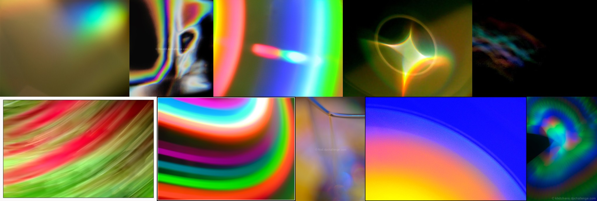

### 🔧 `mcp__dataset-curation__search`

```json
{
  "query": "damaged film scratched burned exposed analog negative decay",
  "dataset": "photos",
  "negative_prompts": "[\"watermark text overlay\", \"blank empty frame\"]",
  "negative_threshold": "0.3",
  "t": "10"
}
```

**Result:**

Grid image saved at: /home/wg25r/aas2/AAv2/.mcp_version/tmp/grid_24.jpg
Use the Read tool to view it.
Showing top 10 results for 'damaged film scratched burned exposed analog negative decay' in photos.
Top-10 scores: [0.4754, 0.4753, 0.4512, 0.4489, 0.4449, 0.4430, 0.4424, 0.4394, 0.4350, 0.4299]
Similarity distribution: counts=[239, 11059, 63351, 90571, 61325, 22199, 5242, 1025, 146, 16], bins=[-0.094, -0.037, 0.020, 0.077, 0.134, 0.191, 0.248, 0.305, 0.362, 0.418, 0.475]

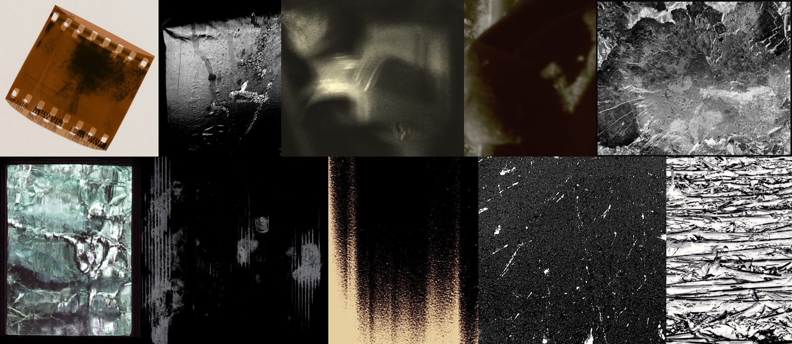

### 🔧 `Read`

```json
{
  "file_path": "/home/wg25r/aas2/AAv2/.mcp_version/tmp/grid_23.jpg"
}
```

### 🔧 `Read`

```json
{
  "file_path": "/home/wg25r/aas2/AAv2/.mcp_version/tmp/grid_24.jpg"
}
```

### 🔧 `mcp__dataset-curation__log_actions`

```json
{
  "msg": "Grid 23 (chromatic aberration/color fringing): Vivid results — iridescent lens flare rainbow on dark background, colorful refraction with figure, prismatic light streak, glowing star-burst flare, colorful light arc, red/green/yellow motion streak, rainbow neon ring, lens optics distortion, blue/yellow/red spectrum gradient. More \"prismatic/iridescent light effects\" than strict chromatic aberration, but all are optical distortion/diffraction phenomena. Peak 0.436. Will sample and commit at ~0.38.\n\nGrid 24 (damaged film analog decay): Excellent — actual film strip with brownish decay, dark damaged negative texture, dark burned/exposed film, black rough texture damage, crumpled metallic (foil-like damaged negative), heavy vertical drip artifacts (chemical decay), burned/dripping dark texture, scratched pattern (B&W), static noise texture. All authentic film damage aesthetics. Peak 0.475, good distribution above 0.38. Will commit at 0.38."
}
```

**Result:**

Logged.

### 🔧 `mcp__dataset-curation__sample`

```json
{
  "query": "chromatic aberration color fringing lens distortion optical error",
  "dataset": "photos",
  "min_threshold": "0.37",
  "max_threshold": "0.43",
  "count": "6",
  "negative_prompts": "[\"watermark text overlay\", \"blank empty frame\"]",
  "negative_threshold": "0.3"
}
```

**Result:**

Grid image saved at: /home/wg25r/aas2/AAv2/.mcp_version/tmp/grid_25.jpg
Use the Read tool to view it.
Sampled 6 from 37 candidates.

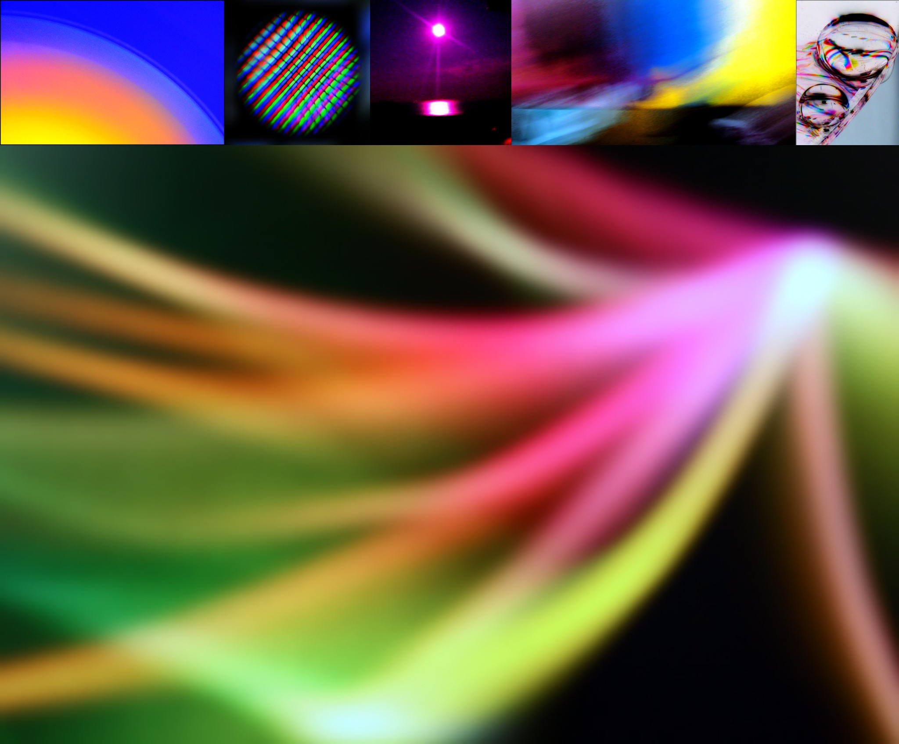

### 🔧 `mcp__dataset-curation__sample`

```json
{
  "query": "damaged film scratched burned exposed analog negative decay",
  "dataset": "photos",
  "min_threshold": "0.38",
  "max_threshold": "0.47",
  "count": "6",
  "negative_prompts": "[\"watermark text overlay\", \"blank empty frame\"]",
  "negative_threshold": "0.3"
}
```

**Result:**

Grid image saved at: /home/wg25r/aas2/AAv2/.mcp_version/tmp/grid_26.jpg
Use the Read tool to view it.
Sampled 6 from 79 candidates.

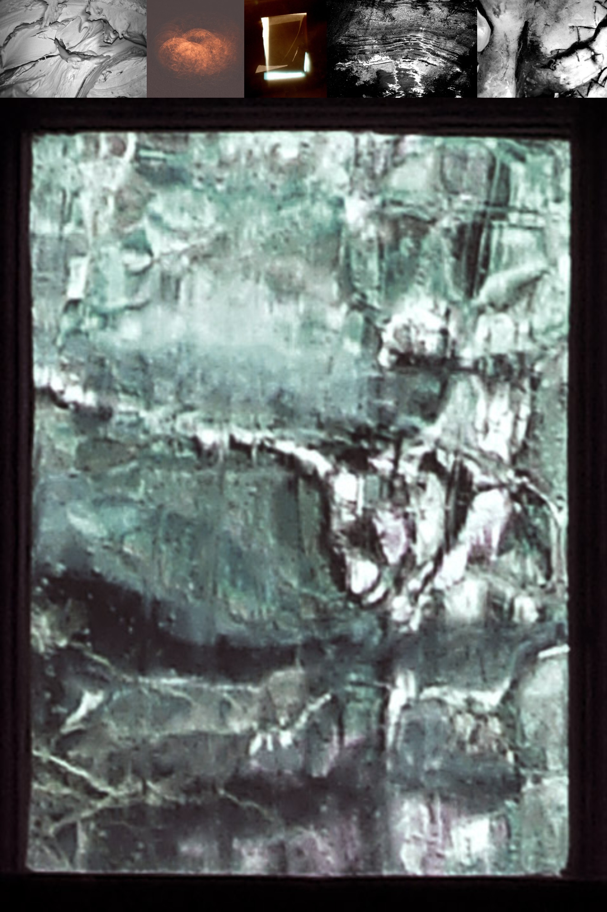

### 🔧 `Read`

```json
{
  "file_path": "/home/wg25r/aas2/AAv2/.mcp_version/tmp/grid_25.jpg"
}
```

### 🔧 `Read`

```json
{
  "file_path": "/home/wg25r/aas2/AAv2/.mcp_version/tmp/grid_26.jpg"
}
```

### 🔧 `mcp__dataset-curation__log_actions`

```json
{
  "msg": "Grid 25 (chromatic aberration, 0.37-0.43): Blue/orange gradient circle (spectrum split), RGB LED pixel close-up, magenta laser pinpoint, yellow/blue motion streak (with slight color shift at edges), small chromatic aberration ring close-up. Large image: vivid rainbow light fiber fan spread on black — beautiful prismatic light diffraction. All are optical color phenomena / light diffraction, closely related to chromatic aberration. 37 candidates. Quality is good.\n\nGrid 26 (damaged film/analog decay, 0.38-0.47): Top row: dark tree silhouette on bleached/burned negative, glowing orange orb on film (light leak effect), illuminated film/photo square, bleached tree silhouette. Large image: crumpled, cyanotype-like developed photographic print with abstract dark stains and organic texture — genuine damaged/aged photographic material. Excellent analog degradation content. 79 candidates.\n\nBoth are strong. Will commit both now."
}
```

**Result:**

Logged.

### 🔧 `mcp__dataset-curation__commit`

```json
{
  "query": "chromatic aberration color fringing lens distortion optical error",
  "dataset": "photos",
  "threshold": "0.37",
  "negative_prompts": "[\"watermark text overlay\", \"blank empty frame\"]",
  "negative_threshold": "0.3",
  "message": "anti_aesthetics | digital_artifacts — chromatic aberration, prismatic lens distortion, color fringing, optical error, rainbow light diffraction artifacts"
}
```

**Result:**

Committed with ID: 0fa1222c, message: anti_aesthetics | digital_artifacts — chromatic aberration, prismatic lens distortion, color fringing, optical error, rainbow light diffraction artifacts with 39 images.

### 🔧 `mcp__dataset-curation__commit`

```json
{
  "query": "damaged film scratched burned exposed analog negative decay",
  "dataset": "photos",
  "threshold": "0.38",
  "negative_prompts": "[\"watermark text overlay\", \"blank empty frame\"]",
  "negative_threshold": "0.3",
  "message": "anti_aesthetics | analog_degradation | film_artifacts — damaged film negative, burned/scratched analog, chemical decay, light leaks, aged photographic material, organic film damage"
}
```

**Result:**

Committed with ID: f642cb2d, message: anti_aesthetics | analog_degradation | film_artifacts — damaged film negative, burned/scratched analog, chemical decay, light leaks, aged photographic material, organic film damage with 81 images.

### 🔧 `mcp__dataset-curation__log_actions`

```json
{
  "msg": "Committed 39 chromatic aberration/optical distortion and 81 damaged film/analog decay images.\n\nRunning total for this session: ~1041 images across 10 commits.\n\nSub-type coverage summary:\n- intentional_blur: 208 (ICM) + 131 (soft focus) + 293 (long exposure) = 632\n- double_exposure: 122\n- film_artifacts: 91 (grain B&W) + 34 (high ISO) + 81 (damaged film) = 206\n- analog_degradation: 22 (VHS) + 81 (damaged film, shared) = ~103\n- digital_artifacts: 20 (glitch RGB) + 39 (chromatic aberration) = 59\n\nNow searching for 2 more to round out: \n1. Multiple exposure layered landscapes (double_exposure variant)\n2. Pixel sorting / datamosh glitch art (digital_artifacts variant)\nThese will complete the full 5 sub-type coverage."
}
```

**Result:**

Logged.

### 🔧 `mcp__dataset-curation__search`

```json
{
  "query": "multiple exposure layered silhouette forest nature blended scene",
  "dataset": "photos",
  "negative_prompts": "[\"watermark text overlay\", \"blank empty frame\"]",
  "negative_threshold": "0.3",
  "t": "10"
}
```

**Result:**

Grid image saved at: /home/wg25r/aas2/AAv2/.mcp_version/tmp/grid_27.jpg
Use the Read tool to view it.
Showing top 10 results for 'multiple exposure layered silhouette forest nature blended scene' in photos.
Top-10 scores: [0.5039, 0.5030, 0.4853, 0.4813, 0.4794, 0.4707, 0.4688, 0.4674, 0.4666, 0.4646]
Similarity distribution: counts=[275, 13741, 75798, 93264, 46637, 17841, 5885, 1450, 251, 31], bins=[-0.137, -0.073, -0.009, 0.056, 0.120, 0.184, 0.248, 0.312, 0.376, 0.440, 0.504]

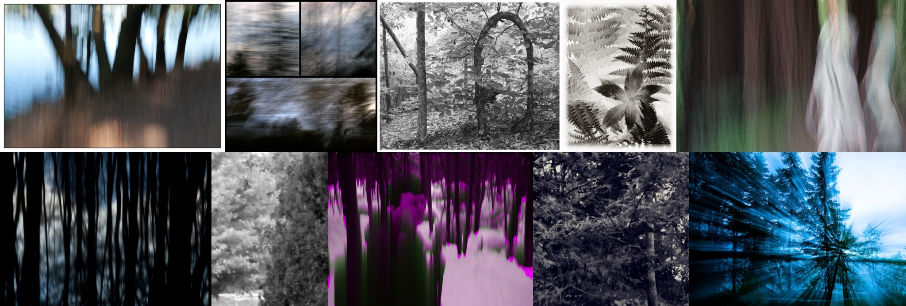

### 🔧 `mcp__dataset-curation__search`

```json
{
  "query": "pixel sorting glitch art digital manipulation scanline shift",
  "dataset": "photos",
  "negative_prompts": "[\"watermark text overlay\", \"blank empty frame\"]",
  "negative_threshold": "0.3",
  "t": "10"
}
```

**Result:**

Grid image saved at: /home/wg25r/aas2/AAv2/.mcp_version/tmp/grid_28.jpg
Use the Read tool to view it.
Showing top 10 results for 'pixel sorting glitch art digital manipulation scanline shift' in photos.
Top-10 scores: [0.3819, 0.3816, 0.3786, 0.3701, 0.3675, 0.3630, 0.3617, 0.3566, 0.3545, 0.3538]
Similarity distribution: counts=[527, 15326, 77999, 98635, 46227, 12561, 3033, 718, 121, 26], bins=[-0.096, -0.048, -0.001, 0.047, 0.095, 0.143, 0.191, 0.238, 0.286, 0.334, 0.382]

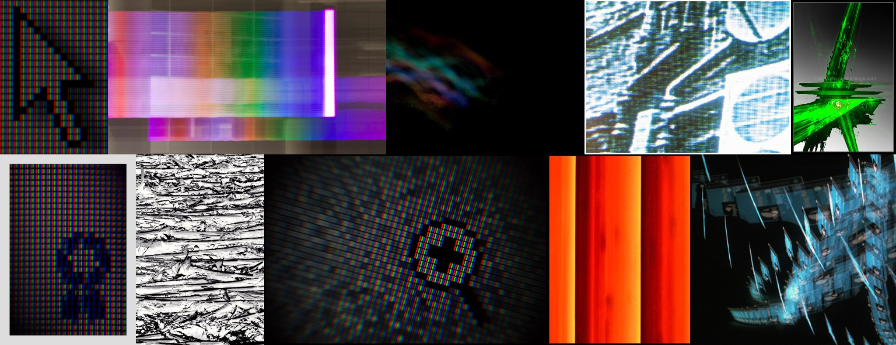

### 🔧 `Read`

```json
{
  "file_path": "/home/wg25r/aas2/AAv2/.mcp_version/tmp/grid_27.jpg"
}
```

### 🔧 `Read`

```json
{
  "file_path": "/home/wg25r/aas2/AAv2/.mcp_version/tmp/grid_28.jpg"
}
```

