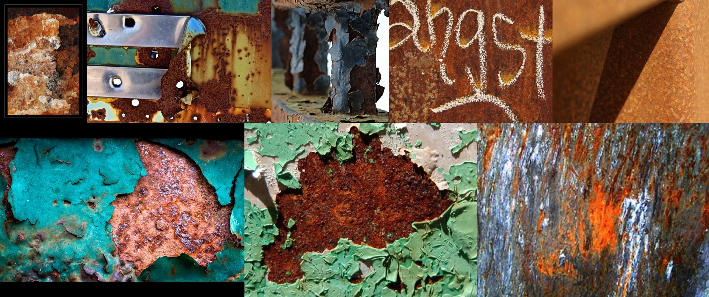

# Sample Debug Log

- turn: 6
- timestamp: 2026-02-23T17:32:37

## LLM Description

采样图像显示：1)带融化层涂层的蔚蓝色极稀灰色钢装置 2)带融化层均匀钢限制表面 3)黄色绿色垡塂上的装置 4)带白色涂鸦文字的铟锈表面 5)纹理化的甚黄色钢板 6)装明静水落島层涂层盗虚 7)甚黄色钢板带装明静水落 8)带水和装置的铟锈表面。进行美学评分。
