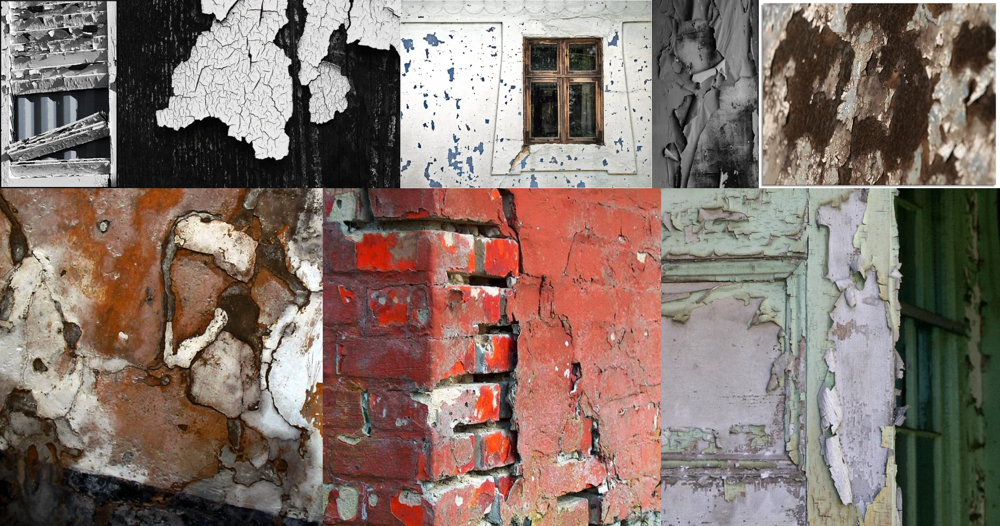

# Sample Debug Log

- turn: 12
- timestamp: 2026-02-23T17:35:10

## LLM Description

采样图像显示：1)黑白色剥落开裂油漆和破损木纹理 2)制高对比度白色剥落墙面 3)带窗户的白色剥落墙面 4)灰度剥落层次表面 5)褐色风化望面 6)褐色和白色剥落油漆层 7)红色和白色剥落油漆在砖墙上 8)淡绿色门框上剥落油漆。
