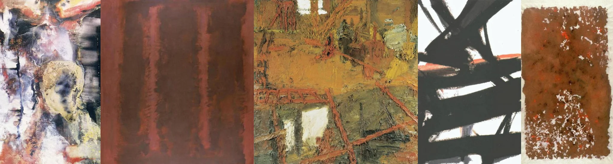

# Sample Debug Log

- turn: 8
- timestamp: 2026-02-23T22:46:53

## LLM Description

Artwork采样显示：抽象表现主义风格的锈蚀纹理画作(含人像轮廓)、铁锈红色调层次感抽象画、厚重颜料描绘的破旧工业空间(锈蚀梯子/管道)、黑底红痕的简略抽象构图、以及红褐色粗糙纹理色块。艺术化表现工业衰败主题，色彩以褐、红、黄为主。
