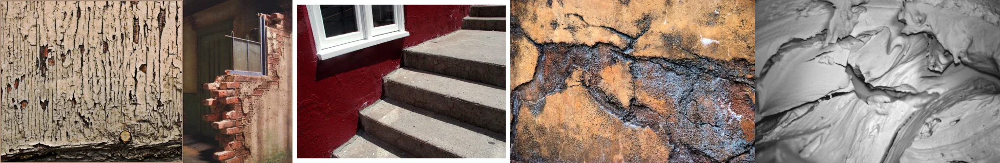

# Sample Debug Log

- turn: 14
- timestamp: 2026-02-23T22:49:36

## LLM Description

Photos采样显示：严重裂纹波纹状剥落油漆木门(露出下层木纹)、破损碎裂的红砖墙体(醒目红色涂层)、深红色墙面与灰色水泥台阶(表面风化)、褐色黑色混杂的强烈裂纹纹理表面、以及灰暗调壁纸/油漆层叠波动裂纹。富有时间痕迹和物质衰变感。继续采样artwork和dreamcore。
