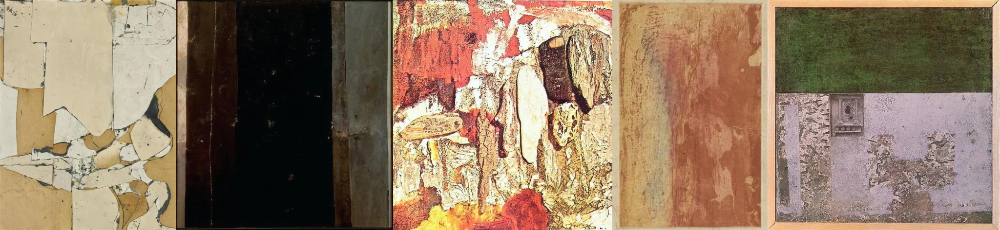

# Sample Debug Log

- turn: 16
- timestamp: 2026-02-23T22:50:14

## LLM Description

Artwork采样显示：攀带状裂纹并发生剥落的深色油漆表面、暗/灰色边框内的壁毁裂纹、红/黄/白多层油漆剥落混合的艺术抽象表现、纯褐色壁画残遗的大面积图、以及绿色/灰色边框的剥落油漆墙体与半明窗。艺术化处理损坏骨架真实纹理。继续dreamcore采样。
