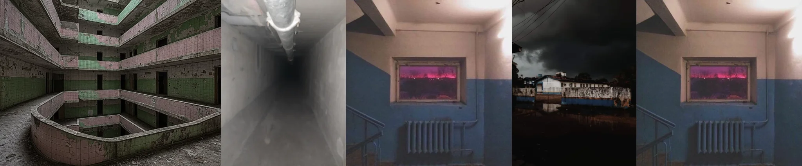

# Sample Debug Log

- turn: 18
- timestamp: 2026-02-23T22:50:59

## LLM Description

Dreamcore采样显示：废弃多层建筑的中空井式庭院(绿/粉小碗砖铺设)、矛形白色管道的未知下降通道(weirdcore生成感)、淡蓝/皮粉双色墙面配紫红色窗景的奇怪室内、风雨天下破旧的平房要塞、以及同样配紫红色窗景的戏剧性反复。充满诡异梦境氛围。所有采样完成，即将进行美学评估和提交。
