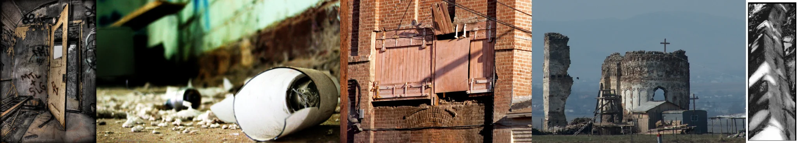

# Sample Debug Log

- turn: 32
- timestamp: 2026-02-23T22:57:36

## LLM Description

Photos采样显示：黑白涂鸦破损内随(全息风格门和粉碎场景)、地面上碎裂的白色炖蒙壶(陌生物境)、红砖建筑外的木闺闭合门(与旧壁形成对比)、云端崇山上的圆形墟亡教堂(十字架和明暗对比)、黑白抽象/建筑细节特写(穿透光和金属锁链)。追求失落、荒废全息感。继续采样其他数据集。
