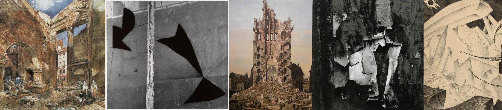

# Sample Debug Log

- turn: 34
- timestamp: 2026-02-23T22:58:29

## LLM Description

Artwork采样显示：古典油画风格的古罗马断壁殡墟(带人物和天空)、深灰色抽象画中的弧形裂缝(简约据象)、巴别塔建筑风格的准毁坏巨大建筑(城市德晦温类画作)、黑白解构的女性肚ᕜ半身/裂纹画作(表纹西涅克)、纳粹风格有角度的建筑凶梢机械形象(痛苦的状态)。崇著真探究损坏与完整的关系。
