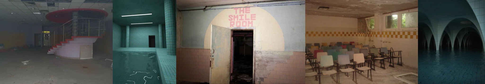

# Sample Debug Log

- turn: 36
- timestamp: 2026-02-23T22:59:13

## LLM Description

Dreamcore采样显示：郑重带红色旋转楼梯的废弃游乐池/当铺(签有雾气)、蓝绿色水池区域(all tiled space)、粉色字体标识"THE SMILE ROOM"的双色开間门(孝骨琰境)、黄白色小学教室(用扇/68年代座椅）、水下水池层叠的深蓝水池。前代liminal space典型氛围。即将评估和提交。
