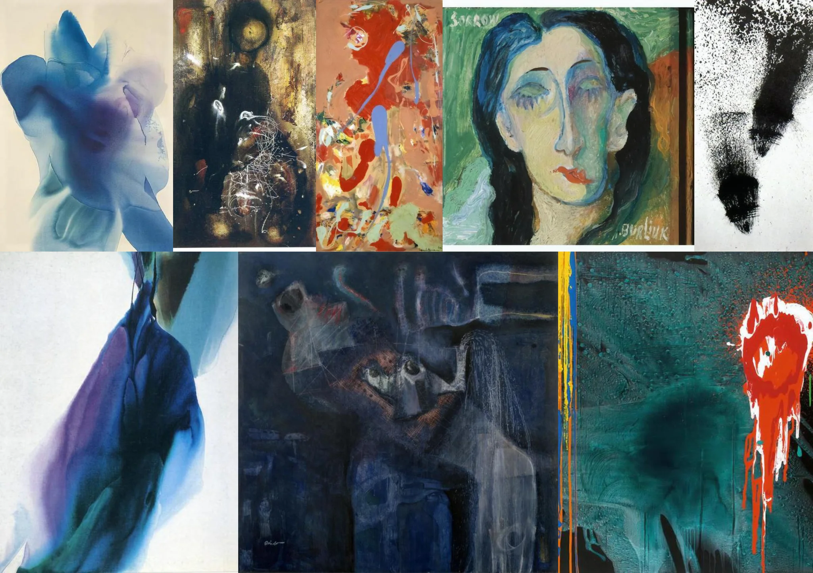

# Sample Debug Log

- turn: 7
- timestamp: 2026-02-24T23:18:24

## LLM Description

Sampled artwork shows: abstract expressionist paintings with melancholic faces, paint drips suggesting tears, distorted human figures, dark moody color palettes with blues and blacks. Include portrait with closed sad eyes and textured paintings suggesting emotional distress through abstraction.
