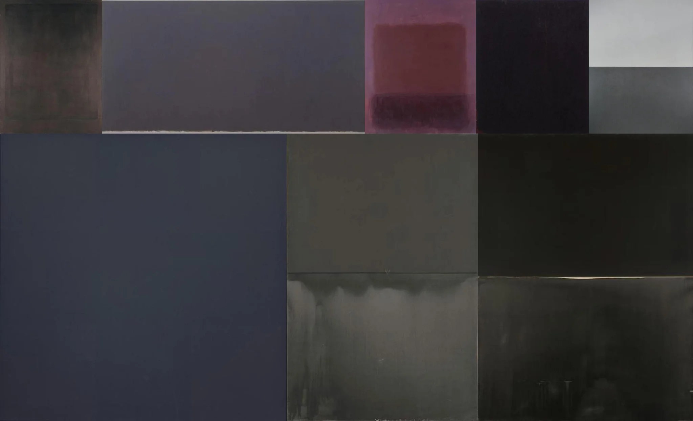

# Sample Debug Log

- turn: 18
- timestamp: 2026-02-24T23:21:37

## LLM Description

Sampled artwork shows: abstract color field paintings in muted dark tones - grays, blacks, deep purples, and reddish rectangles on muted backgrounds. Minimalist compositions suggesting emptiness and melancholy through color alone, resembling Rothko-style meditative but depressing color planes.
