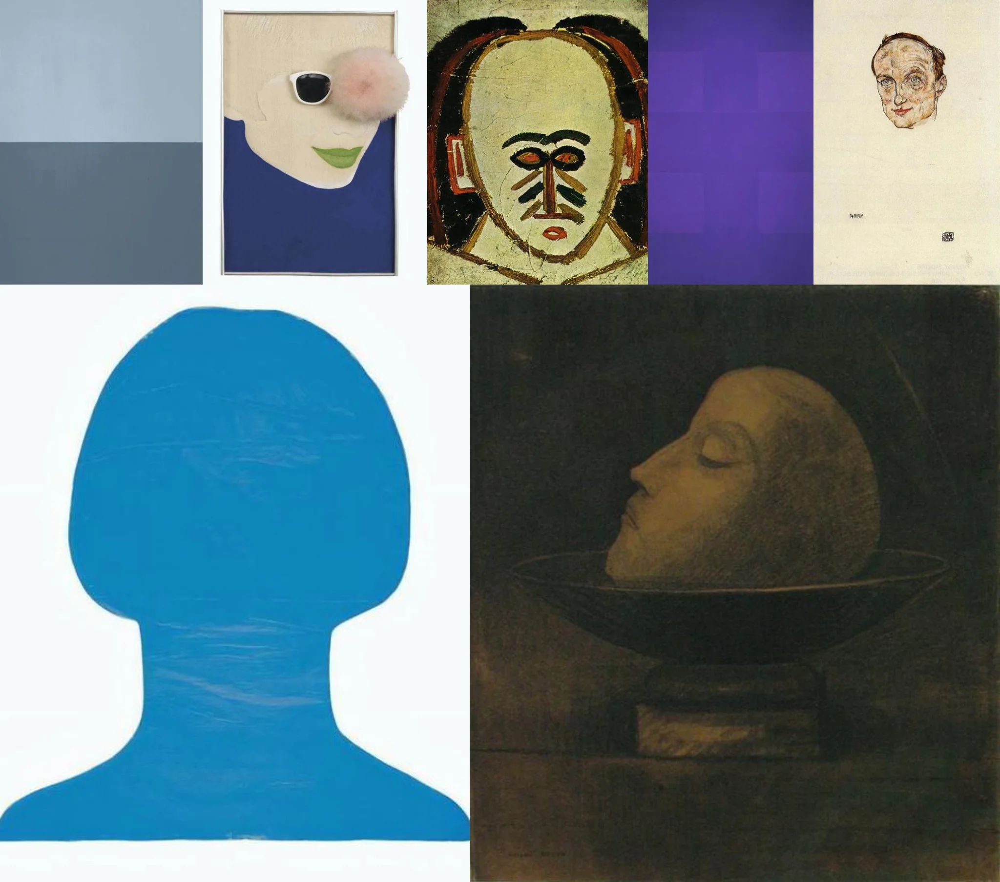

# Sample Debug Log

- turn: 44
- timestamp: 2026-02-24T23:38:19

## LLM Description

Sampled artwork shows: abstract color field paintings with simplified facial forms, German expressionist style portraits with stylized hollow eyes, blue silhouette with featureless face, dark painting of severed head on platter. Mix of abstract and figurative works exploring face, identity, and emptiness.
