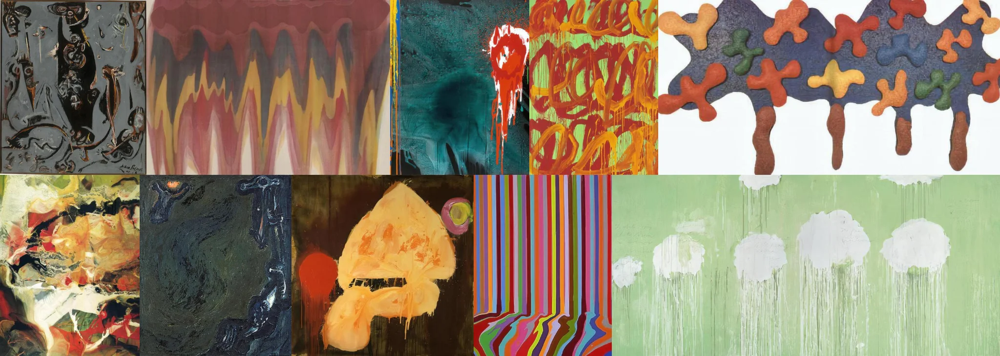

# Sample Debug Log

- turn: 8
- timestamp: 2026-02-24T23:57:55

## LLM Description

Sampled melted objects from artwork dataset. Visible content: Abstract paintings showing dripping/melting effects in various styles—yellow organic mass with belt-like streak on dark background, multicolored vertical stripes warping at bottom, white cloud shapes dripping down green field, red blood-like splatter on teal, orange graffiti-style drips on green, dark monochromatic hanging forms with surreal anatomical distortions, and cross-shaped blobs on white.
