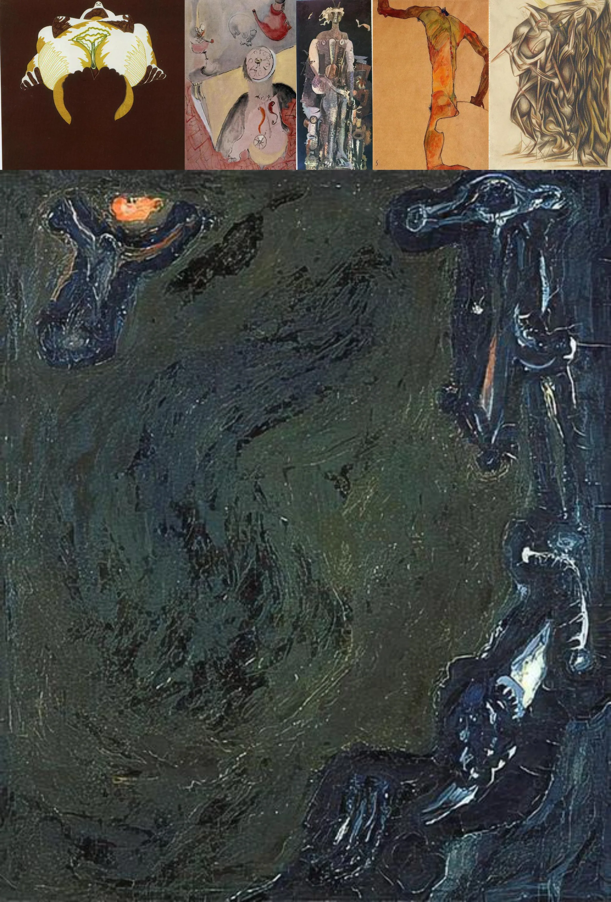

# Sample Debug Log

- turn: 12
- timestamp: 2026-02-25T00:00:12

## LLM Description

Sampled 6 anatomical deformity images: distorted humanoid figures with elongated limbs and twisted proportions, mixed media collages with floating organs and clock faces, dark green expressionistic painting showing crucified/deformed figures with thick texture. High anti-aesthetic value with bodily unease and surreal anatomical distortions.
