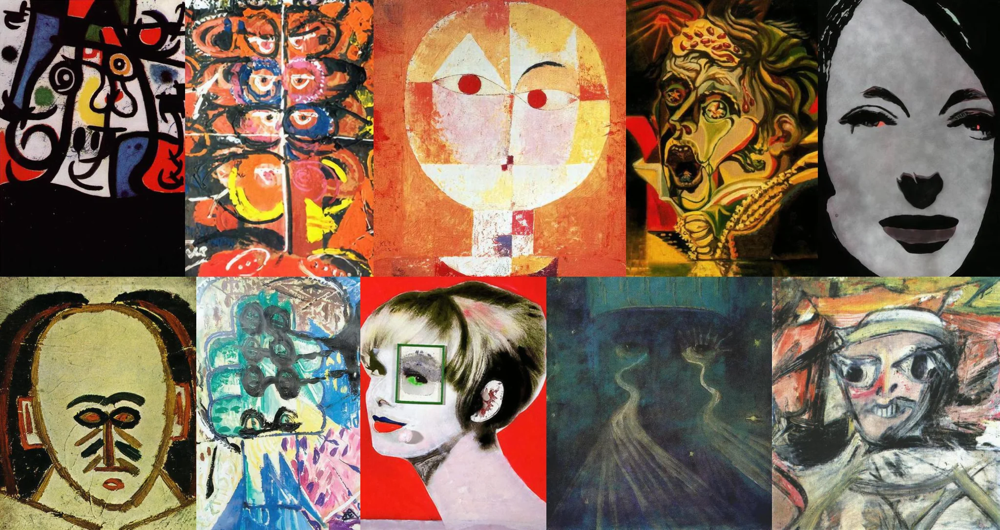

# Sample Debug Log

- turn: 20
- timestamp: 2026-02-25T00:08:17

## LLM Description

Sampled 10 facial displacement images: abstract portraits with misaligned/misplaced features including cubist multi-perspective faces, geometric compositions with offset eyes and mouths, expressionist screaming figures with distorted proportions, African-mask-inspired stylized faces, and pop-art style portraits with green validation box overlaid on one eye creating uncanny effect.
