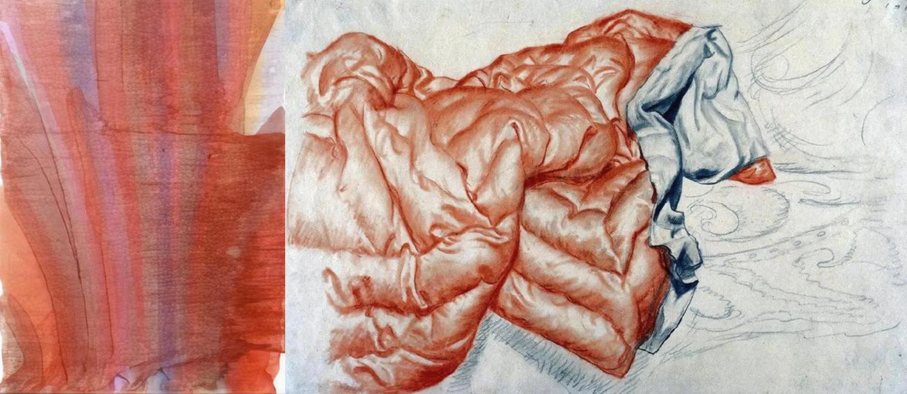

# Sample Debug Log

- turn: 28
- timestamp: 2026-02-25T00:14:26

## LLM Description

Sampled crumpled fabric from artwork: academic-style drawing in sanguine/chalk showing heavily wrinkled drapery with chaotic folding and complex texture, alongside more abstract red/orange layered fabric study. The twisted material suggests material degradation even within traditional draftsmanship.
