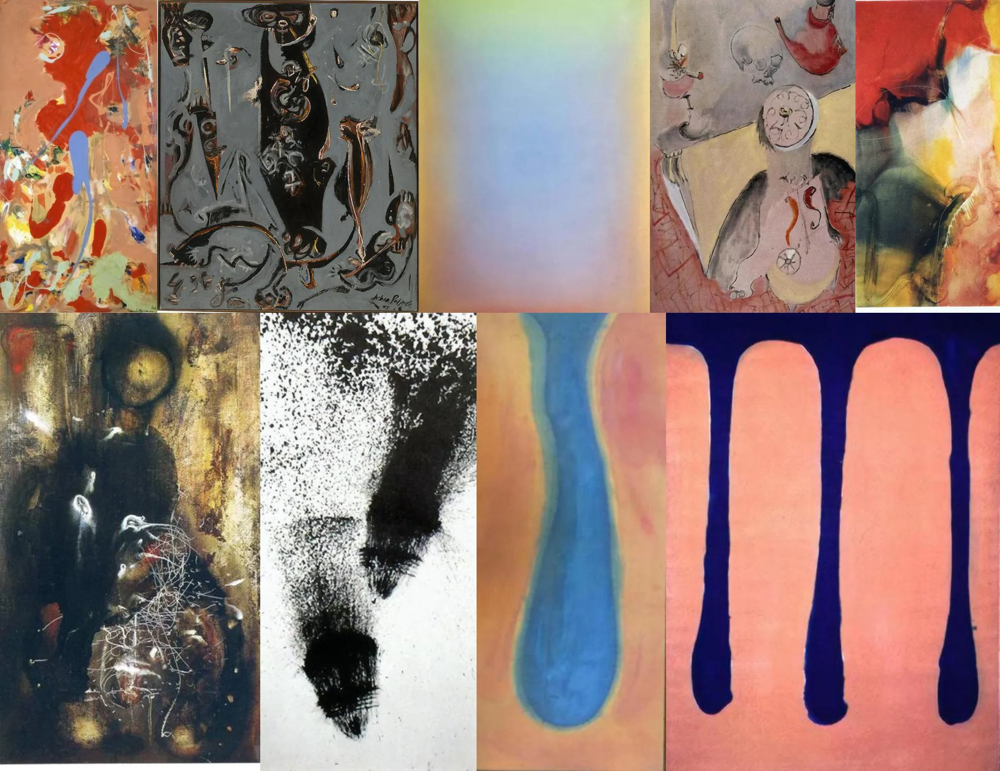

# Sample Debug Log

- turn: 31
- timestamp: 2026-02-25T00:16:14

## LLM Description

Sampled Dalí-esque melting artwork: abstract expressionist drips and splatters in coral/red/blue, dark complex surrealist composition with distorted anatomical forms, soft color-field gradient, mixed-media collage with clock imagery suggesting liquefaction, black ink wash with dripping effect, and a prominent pink background with blue paint drips resembling melting columns.
