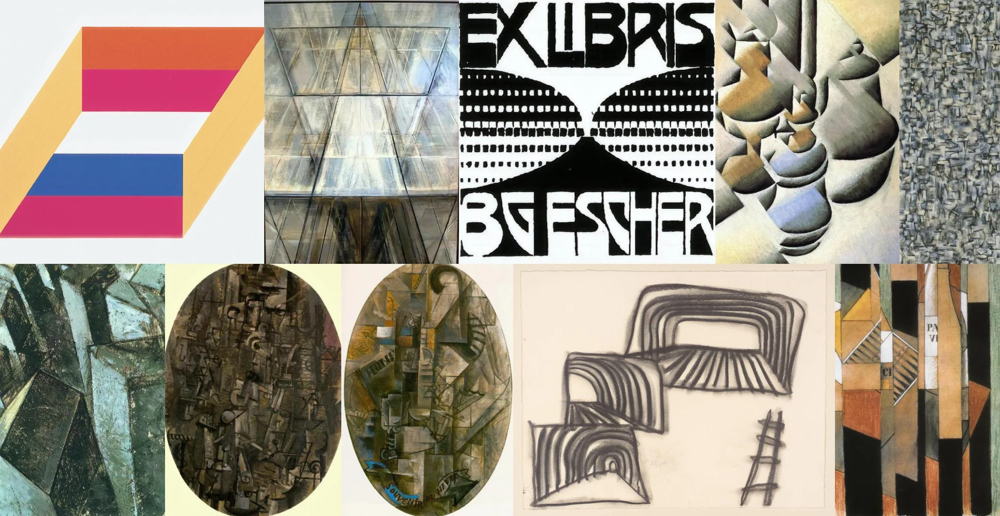

# Sample Debug Log

- turn: 33
- timestamp: 2026-02-25T00:16:52

## LLM Description

Sampled non-euclidean geometry from artwork: includes Escher-style EX LIBRIS bookplate with mirrored 'BTFESCHER' text, cubist multi-perspective architectural studies, abstract geometric compositions with impossible angles, M.C. Escher staircases with paradoxical spatial relationships, fragmented crystalline structures, and Penrose-like impossible triangle constructions in bold color blocks.
