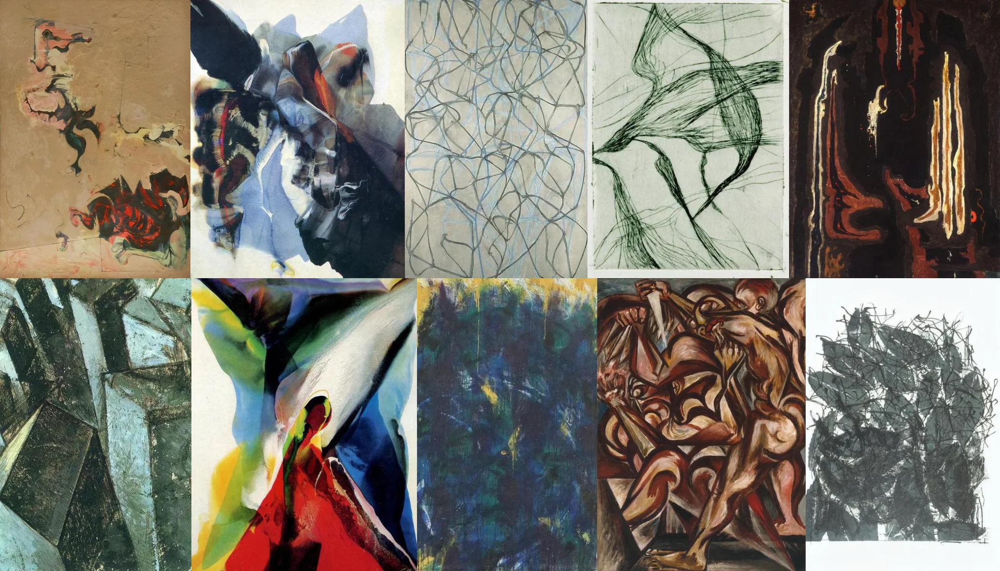

# Sample Debug Log

- turn: 35
- timestamp: 2026-02-25T00:17:41

## LLM Description

Sampled anatomical deformity at lower threshold (0.35-0.40): 111 candidates found. Images show expressionist twisted figures, cubist anatomical studies with exaggerated musculature, abstract gestural linework suggesting distorted bodies, cracked surface textures revealing red underlayers, fragmented crystalline/abstractions, and shadowy dark paintings with dripping effects suggesting bodily dissolution.
