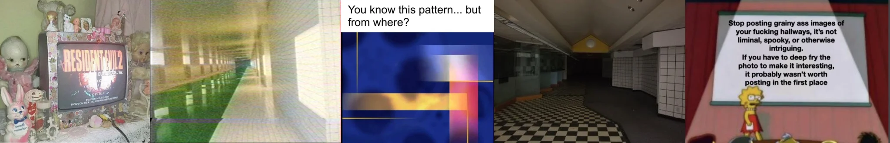

# Sample Debug Log

- turn: 39
- timestamp: 2026-02-25T00:21:05

## LLM Description

Sampled glitch/corruption from dreamcore: vintage CRT gaming setup with Resident Evil 2 surrounded by uncanny dolls, motion-blur hallway with green landscape visible through windows suggesting spatial dissociation, blue test pattern bars with glitched color artifacts, empty checkered-floor liminal corridor with fluorescent hospital lighting, and meme image critiquing grainy photography aesthetics.
