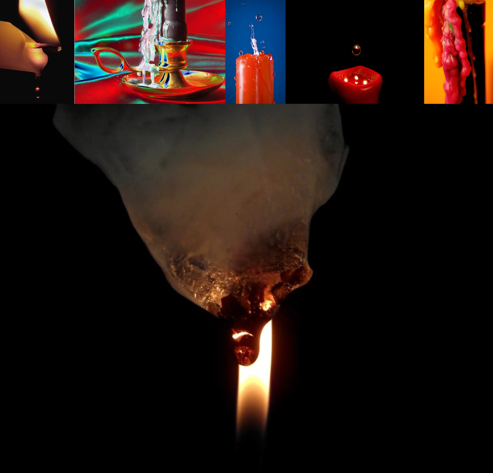

# Sample Debug Log

- turn: 45
- timestamp: 2026-02-25T00:28:11

## LLM Description

Sampled melted wax/liquid from photos: close-up macro shots of lit candles with melted wax forming organic drips and accumulation, red candle with water droplets creating surreal texture contrast, black candle with thick layers of melted wax at base, and smoke/smoldering wax suggesting material degradation through flame.
