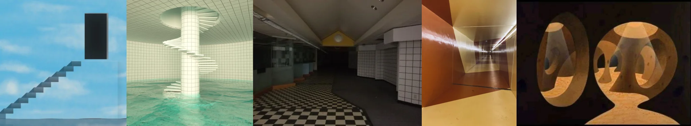

# Sample Debug Log

- turn: 47
- timestamp: 2026-02-25T00:32:48

## LLM Description

Sampled impossible structures from dreamcore: floating stone staircase ascending to black rectangular void in blue sky, spiral staircase descending into flooded pool room with white tiles, empty liminal corridor with checkered floor and fluorescent lights, light-trail perspective in orange corridor, and wooden Escher-style impossible sculpture creating spatial paradox.
