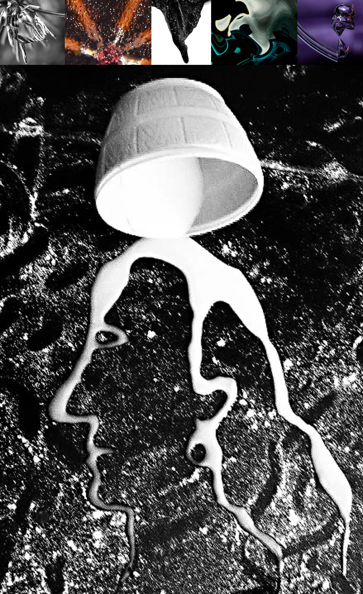

# Sample Debug Log

- turn: 51
- timestamp: 2026-02-25T00:42:12

## LLM Description

Sampled liquefied surreal photographs: prominent image shows black-and-white high-contrast composition where white liquid/wax forms profiles of two faces in negative space against dark textured background, topped with bowl-like shape suggesting poured material. Additional thumbnails show metallic twisted forms, molten orange material with bubbles, dark organic shapes, teal/black fluid abstractions, and glossy organic reflective sculptures.
