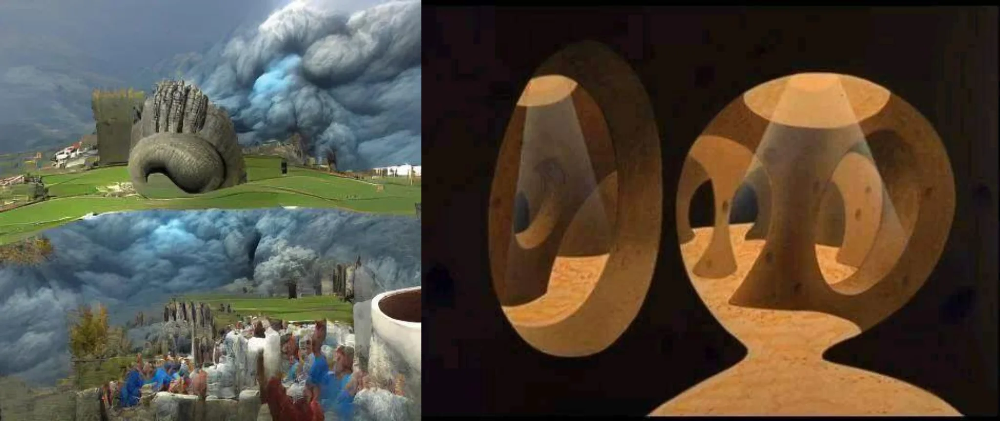

# Sample Debug Log

- turn: 53
- timestamp: 2026-02-25T00:46:00

## LLM Description

Sampled dreamcore anatomical/surreal: left image shows colossal stone hand emerging from pastoral landscape with massive storm clouds above and crowd gatherings below, creating impossible scale and spatial paradox. Right image shows wooden impossible sculpture with geometric voids creating Escher-like spatial contradictions where interior/exterior relationships defy physical logic.
