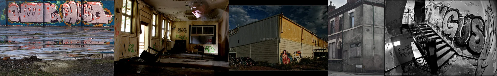

# Sample Debug Log

- turn: 8
- timestamp: 2026-02-16T18:13:59

## LLM Description

Sample结果：5张废弃建筑图片。内容观察：1) 蓝底粉色泡沫涂鸦样式字母；2) 废弃房屋内部，剥落的天花板、窗户透入光线、绿色涂鸦；3) 暗色调工业建筑，外墙彩色涂鸦画；4) 灰色混凝土建筑外观带涂鸦；5) 黑白照片显示楼梯与大型涂鸦字母（高对比度）。
