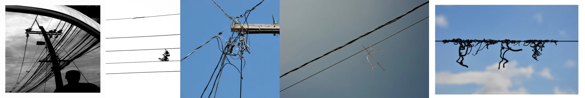

# Sample Debug Log

- turn: 12
- timestamp: 2026-02-16T18:16:34

## LLM Description

Sample结果：5张杂乱电线图片。内容观察：1) 黑白照片，电线杆与密集电线，前景人影剪影；2) 纯白背景下电线上的人影构图；3) 蓝天下的木质电线杆，多条电线向各方向延伸；4) 灰天空下的交叉电线与几个小分支；5) 蓝天下电线上悬挂的干枯植物藤蔓。
