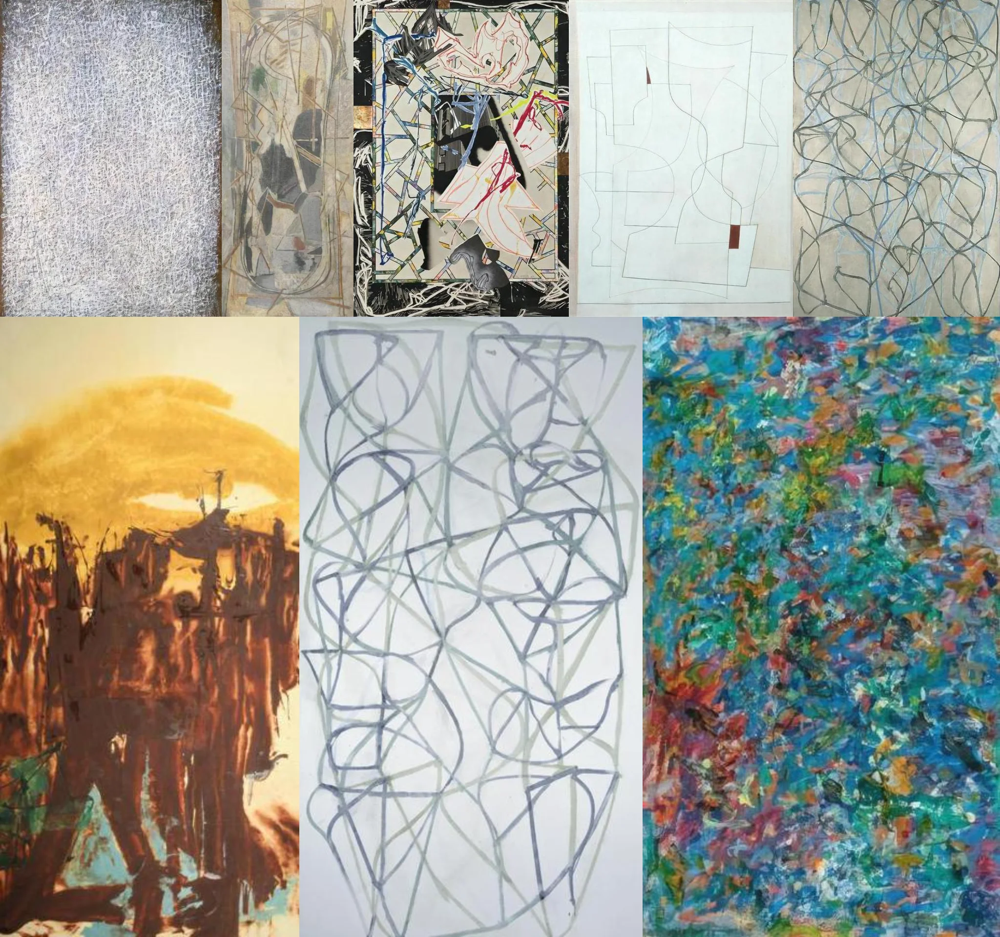

# Sample Debug Log

- turn: 4
- timestamp: 2026-02-25T02:34:19

## LLM Description

Sample shows unfinished artworks: dense scribbled lines on canvas, layered sketches with construction lines visible, abstract chaotic line drawings, minimalist outlines with blocked areas, and partially rendered paintings with visible underlayers. Row 2 shows warm-toned unfinished landscape with rough brushwork, gray tangled continuous line drawing on white paper, and thick impasto paint in chaotic multicolored strokes showing work-in-progress texture.
