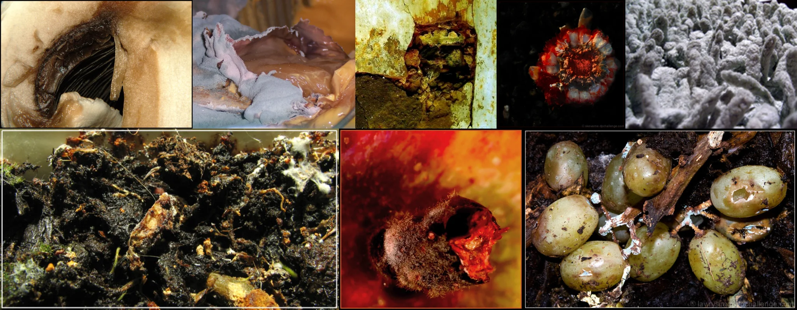

# Sample Debug Log

- turn: 15
- timestamp: 2026-02-25T02:39:01

## LLM Description

Sample shows organic decay: decomposing biological matter with dark soil and rot, slimy gray mold colonies on white fibrous substrate, rusted corroded metal corner with green oxidation, broken shell with red exposed interior, rotten grapes with holes and insect damage surrounded by dark soil.
