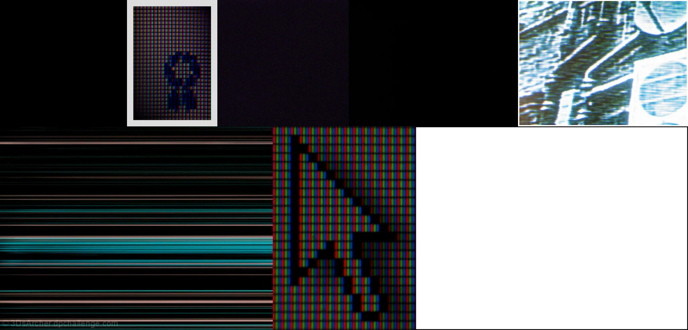

# Sample Debug Log

- turn: 19
- timestamp: 2026-02-25T02:40:12

## LLM Description

Mixed results: amateur snapshot search returned mostly empty/poor content at threshold - text overlays, abstract blurs. Kitsch similar - white frames, gradients. Aliasing sample shows RGB pixel grid patterns, horizontal scanlines, pixelation artifacts close-ups of LCD screens. These aliasing artifacts look good for the dataset but need better thresolds. Will adjust queries for amateur and kitsch.
