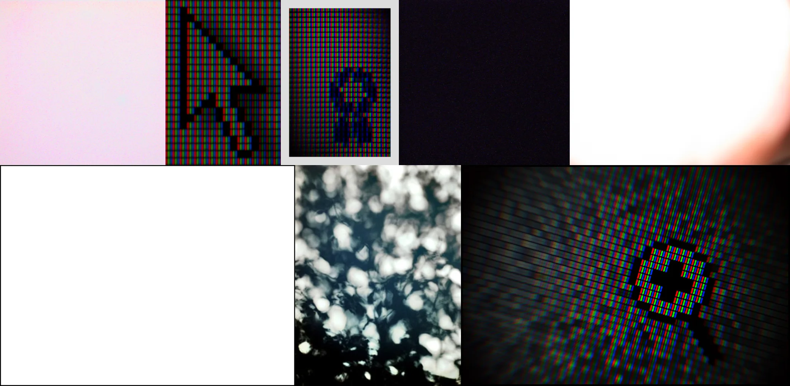

# Sample Debug Log

- turn: 27
- timestamp: 2026-02-25T02:43:20

## LLM Description

Sample shows digital aliasing artifacts: extreme close-ups of RGB subpixel grids on LCD screens, blocky pixelated cursor icons with staircase edges, horizontal scanline patterns, and gradient color bars showing discrete pixel boundaries.
