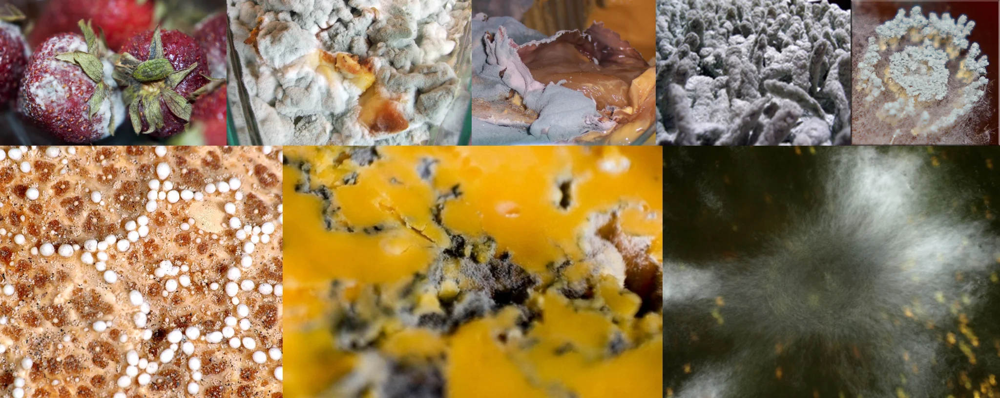

# Sample Debug Log

- turn: 33
- timestamp: 2026-02-25T02:45:41

## LLM Description

Sample shows biological decay: moldy strawberries covered in white fungal growth, thick green-blue mold colonies on decomposed food, gray slime mold with gelatinous texture, circular bacterial colonies on agar plates, orange surface with black fungal infestation, and fuzzy white mycelium spreading across surfaces.
