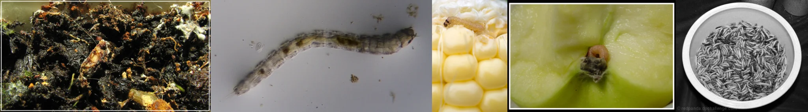

# Sample Debug Log

- turn: 44
- timestamp: 2026-02-25T03:01:24

## LLM Description

Sample shows visceral insect decay: pale segmented maggots/moth larvae, black soil teeming with decomposing organic matter and insect activity, worm on yellow corn cob kernels, bowl filled with maggot infestation, and white segmented larvae embedded in green plant tissue showing biological decomposition.
