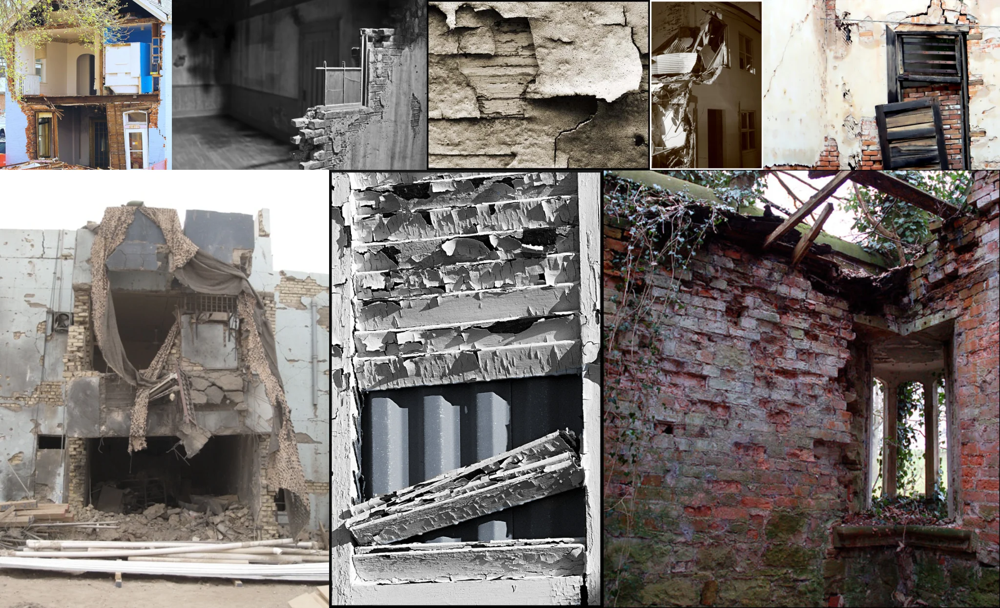

# Sample Debug Log

- turn: 46
- timestamp: 2026-02-25T03:04:48

## LLM Description

Sample shows architectural decay patterns: severely fire-damaged interior with blackened walls, peeling paint revealing brick texture, close-up of flaking plaster layers, sunrise-lit crumbling building facade partially collapsed, and overgrown brick ruin with broken window frames and damaged lintel.
