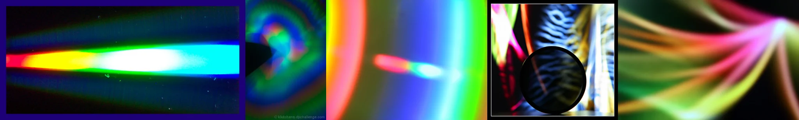

# Sample Debug Log

- turn: 6
- timestamp: 2026-02-24T22:04:29

## LLM Description

Sampled chromatic aberration images show: (1) horizontal light streak with rainbow edge fringing on dark background, (2) swirling circular pattern with concentric color separation in greens/cyans/oranges, (3) large curved rainbow gradient with sharp color transitions, (4) zebra-patterned abstract with rainbow bleeding at edges and circular mask overlay, (5) soft radiating rainbow light streaks. All demonstrate optical color fringing effects as intended for anti-aesthetic sub-element.
