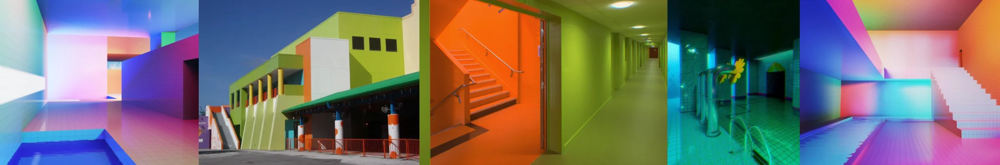

# Sample Debug Log

- turn: 10
- timestamp: 2026-02-24T22:10:42

## LLM Description

Sampled toxic neon images display: iridescent pastel poolroom with pink-purple-blue gradient walls, bright lime-green industrial building with orange accents, aggressive orange staircase against neon lime corridor walls, dark poolroom with intense cyan/teal lighting creating sickly glow, and hyper-saturated pink-cyan gradient interior with white stairs. All show synthetic hyper-bright color palettes creating visual discomfort and aggressive contrast typical of overstimulating, unstable aesthetics.
