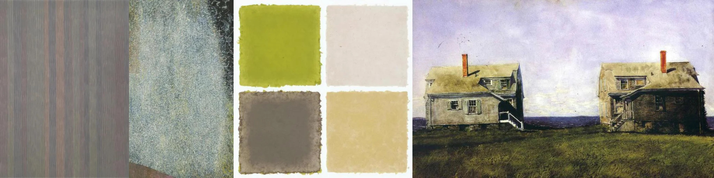

# Sample Debug Log

- turn: 13
- timestamp: 2026-02-24T22:13:18

## LLM Description

Sampled retro faded images show: vertical striations in muted brownish tones, wide textured surface with grainy aged blue-green patina, four watercolor swatches in muted olive/off-white/gray/beige, and a faded landscape painting of houses with washed-out lavender sky and desaturated green field. Visual content confirms timeworn low-saturation palettes with archival decay appearance.
