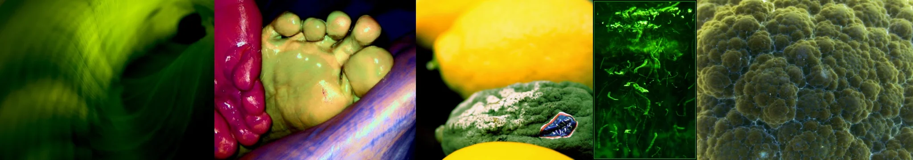

# Sample Debug Log

- turn: 15
- timestamp: 2026-02-24T22:15:15

## LLM Description

Sampled sickly color cast images display: blurry greenish-yellow plant matter, grotesque yellow sculptural foot-objects with magenta hands against dark purple, mold-covered green vegetable among yellow lemons, intense green-lit microscopic biological texture, and yellow-brown mottled surface resembling decaying organic colonies. Visual content confirms unhealthy tinting suggesting rot and contamination across organic subjects.
