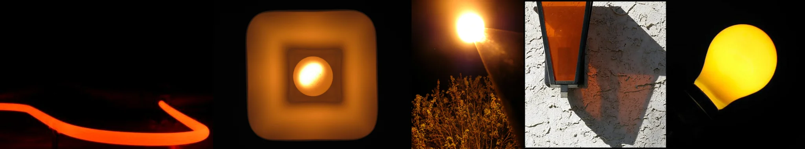

# Sample Debug Log

- turn: 23
- timestamp: 2026-02-24T22:21:31

## LLM Description

Sampled sodium vapor images show: curved red-orange neon light trail on black background, square orange light fixture with concentric glowing rings, bright street lamp with intense yellow-orange flare and lens flare effect, orange-tinted window casting heavy shadow on white textured wall, and bright yellow light bulb against black. All display the characteristic harsh yellow-orange artificial lighting that overwhelms neutral tones, exactly the sodium vapor cast anti-aesthetic.
