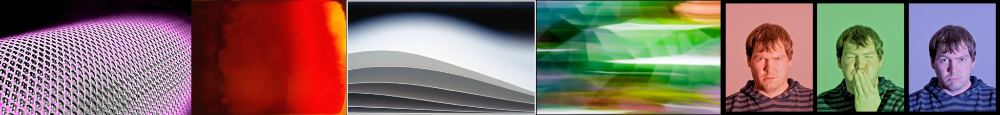

# Sample Debug Log

- turn: 25
- timestamp: 2026-02-24T22:23:43

## LLM Description

Sampled color banding images display: pink-purple gradient on mesh showing visible stepped transitions, red-orange gradient with posterization artifacts, gray-white smooth gradient with subtle steps, green-white motion blur with quantization bands, and triptych portraits with different solid backgrounds showing compression artifacts and mosquito noise. All demonstrate limited tonal precision with visible steps between shades rather than smooth gradients.
