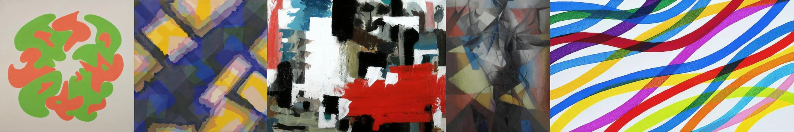

# Sample Debug Log

- turn: 27
- timestamp: 2026-02-24T22:26:17

## LLM Description

Sampled clashing colors artworks show: interlocking green and coral organic shapes, geometric abstract with blue-yellow-pink overlapping forms, bold expressionist painting with aggressive black-white-red-blue contrasts, transparent geometric overlaps in cool tones, and bright wavy color ribbons in saturated primaries. Visual content demonstrates palette conflicts creating visual discomfort through unbalanced, aggressive color relationships.
