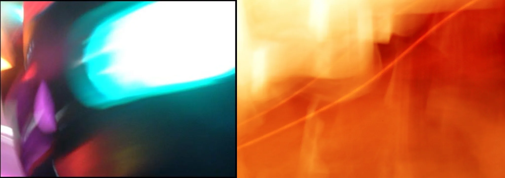

# Sample Debug Log

- turn: 38
- timestamp: 2026-02-24T22:38:40

## LLM Description

Sampled uneven white balance images show: split frame with dramatic cyan-blue and magenta-purple color temperature clash on left, and heavy warm orange-yellow tint dominating right frame with visible texture and light streaks. Both demonstrate inconsistent color temperature across scene areas, breaking visual coherence as intended for anti-aesthetic uneven white balance sub-element.
