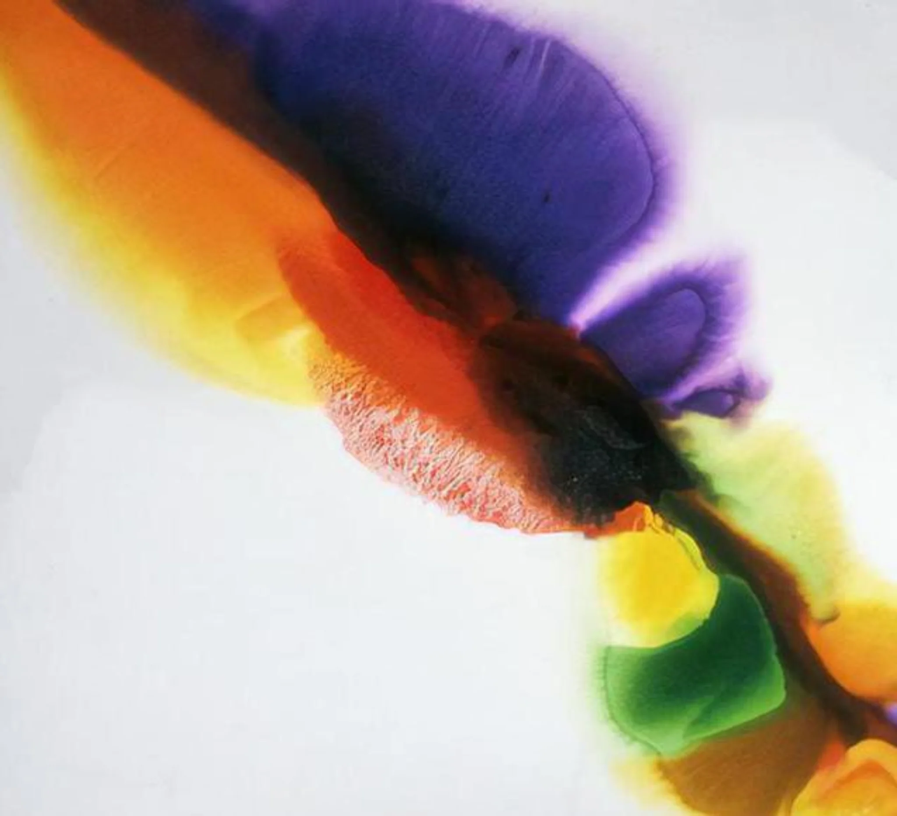

# Sample Debug Log

- turn: 40
- timestamp: 2026-02-24T22:39:32

## LLM Description

Sampled color bleeding artwork shows large swirling ink blot composition with purple, orange, red, yellow, and green pigments actively bleeding and spreading into each other on white ground. Colors seep across boundaries without defined edges, creating soft diffused transitions and halo effects—perfectly demonstrating color degradation and separation loss as intentional anti-aesthetic quality.
