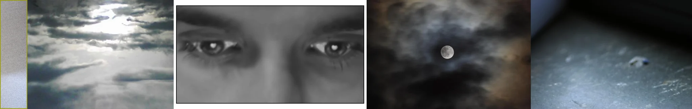

# Sample Debug Log

- turn: 42
- timestamp: 2026-02-24T22:40:23

## LLM Description

Sampled muted color images show: textured grayish wall surface, cloudy sky with stark sun breaking in desaturated tones, black-and-white close-up portrait with visible tear, moon viewed through dark muted clouds, and dimly-lit floor with cool gray-blue tones. All demonstrate low saturation, flat energy, and exhausted lifeless color palettes as anti-aesthetic targets.
