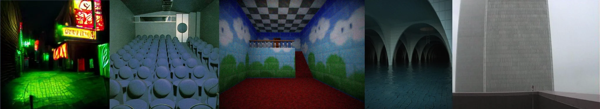

# Sample Debug Log

- turn: 44
- timestamp: 2026-02-24T22:41:20

## LLM Description

Sampled monotone tint images show: green-cast nighttime street with neon signage, heavy blue-tinted room with circular seating arrangement, distorted room with intense red carpet against painted cloud walls, flooded concrete arches with overwhelming blue-green tint, and foggy concrete tower under gray-blue overcast. All demonstrate dominant single-color or narrow-band tints that flatten visual variety and impose heavy somber moods across frames.
