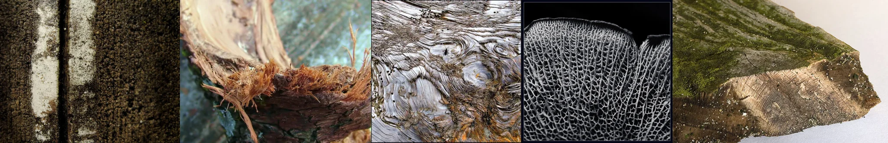

# Sample Debug Log

- turn: 11
- timestamp: 2026-02-25T12:54:49

## LLM Description

Sampled images visible content: Heavy black mold clusters on textured wall surface; splintering wood with fibrous frayed edges; weathered grey tree bark with swirling grain patterns; black and white intricate honeycomb/latticed texture; moss-covered wood slice with green fuzzy growth on decaying cut surface.
