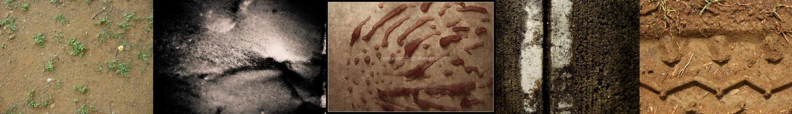

# Sample Debug Log

- turn: 27
- timestamp: 2026-02-25T13:01:08

## LLM Description

Sampled images visible content: Dry dusty soil with sparse green weed patches; high-contrast black and white smoke or particulate texture; blood-red smeared fluid stains on tan surface; thick black mold covering vertical surface in parallel bands; muddy tire tread tracks on brown soil.
