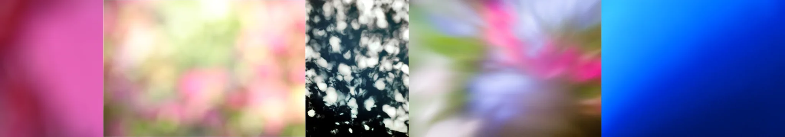

# Sample Debug Log

- turn: 8
- timestamp: 2026-02-24T22:53:24

## LLM Description

Motion blur sampling: Directional streaking patterns in various colors and grayscale, showing extreme speed smearing and light trail effects. Images display chaotic movement with indistinct subjects, ranging from colorful abstract streaks to monochromatic directional blur.

Out of focus sampling: Soft color gradient fields with bokeh light spots in pink, green-yellow, and blue tones. Completely defocused abstract textures with no discernible subjects - only color bleeds and light spots.

Next: Rate aesthetics for these anti-aesthetic clarity degradation elements, then commit batches.
