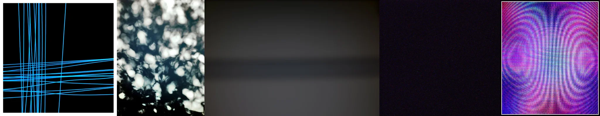

# Sample Debug Log

- turn: 13
- timestamp: 2026-02-24T22:56:58

## LLM Description

VHS/analog corruption samples: blue intersecting lines on black suggesting scanline patterns, out-of-focus tree bokeh, gray soft gradient, near-black frame, and purple-pink concentric circular interference patterns reminiscent of analog signal distortion. Some seem more digital art than authentic VHS artifacts, need to verify in larger sample.
