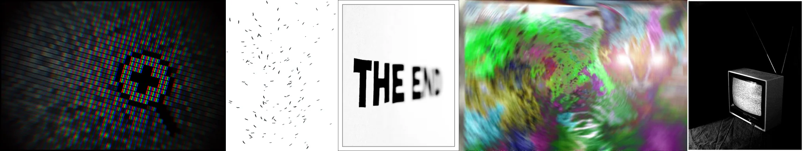

# Sample Debug Log

- turn: 15
- timestamp: 2026-02-24T22:58:37

## LLM Description

VHS/glitch artifacts sample shows: close-up of LCD pixel structure with moire and play icon; white background with scattered black scratches resembling film debris or noise; partial bold text with motion blur/distortion; heavily corrupted video smearing with rainbow colors suggesting digital glitching; CRT television on dark background displaying classic static/noise patterns. Good variety in analog and digital distortion types.
